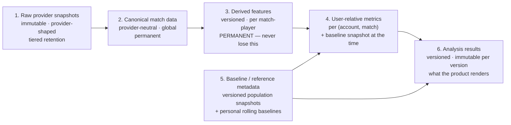

# Data Contracts and Versioning

**Status:** ACTIVE — authoritative
**Last updated:** 2026-09-20
**Scope:** The canonical domain model, global match identity, the separation between raw / normalised / derived data, provider provenance, the three version boundaries, reproducibility, deduplication and idempotency.
**Depends on:** [`SYSTEM-ARCHITECTURE.md`](SYSTEM-ARCHITECTURE.md) §5–§6 · [`decisions/0002-match-id-as-global-unit-of-work.md`](decisions/0002-match-id-as-global-unit-of-work.md)

---

## 1. Plain-English summary

**What is this?** How we store what we learn, and how we make sure we can explain — months later — exactly how a number on a screen was produced.

**Why did we choose it?** Because we already decided that when we improve a measurement, the improvement applies to the *whole* history rather than leaving a seam in the middle ([`../app_foundation/SSOT.md`](../app_foundation/SSOT.md) §14.3). That is only possible if we keep the raw evidence, keep the extracted facts, and stamp every result with which version of which logic made it.

**What does it mean for the user?** Their history never becomes a mix of old and new maths. And when we get better at measuring, their past improves with them instead of being frozen.

**What should future agents not break?** The derived feature store is the thing that must never be lost. Raw provider payloads are big and expire; the derived features are small and are what makes everything reproducible without going back to a provider.

---

## 2. Global identity

### 2.1 `match_id` is the unit of work (normative)

1. A Dota match is stored **once**, globally, keyed on `match_id`. It is **not** keyed on `(user, match)`.
2. All ten player rows are stored with the match, whether or not those players are tracked by us.
3. Tracked accounts are attached to the match as **links**. Adding the fifth tracked account to a match adds one link and zero provider work.
4. User-relative analysis is computed per `(match_id, account_id)` **from the shared match evidence**.
5. Provider fetches, replay-processing requests, raw snapshots and enrichment jobs are all deduplicated on `match_id`.
6. A social graph **MUST NOT** create provider fan-out. Ingestion cost scales with **distinct tracked accounts**, never with follower edges.

```text
1 Dota match  →  1 matches row
              →  10 match_players rows
              →  0..n account links   (one per tracked account in the roster)
              →  0..n analysis results (one per tracked account per analysis version)
              →  exactly 1 provider enrichment path
```

### 2.2 What "tracked" means

An account is tracked if a user owns it **or** at least one user follows it. Tracking is a property of the **account**, not of how many followers it has. One hundred followers of the same account cost exactly what one follower costs.

Followed-but-unowned accounts MAY be given a cheaper service level (less frequent detection, lower enrichment priority). That is a policy choice recorded in [`SCALING-RELIABILITY-AND-OPERATIONS.md`](SCALING-RELIABILITY-AND-OPERATIONS.md) §2, not a separate data model.

---

## 3. The six layers

Each layer has a different lifetime, a different owner and a different reason to exist. Collapsing any two of them breaks either reproducibility or provider independence.



| # | Layer | Contains | Lifetime |
|---|---|---|---|
| 1 | **Raw provider snapshots** | Exactly what a provider returned, unaltered, with provenance. | Tiered — see §6. |
| 2 | **Canonical match data** | Provider-neutral match header and ten player rows. The global truth about the match. | Permanent. |
| 3 | **Derived features** | The versioned feature representation the analysis engine consumes: downsampled trajectories, timings, event-derived counts, lane metrics. Per `(match_id, player_slot)`. | **Permanent. This is the reproducibility unit.** |
| 4 | **User-relative metrics** | Per `(account_id, match_id)` metric observations **plus the baseline snapshot that existed before that match** ([`../app_foundation/SSOT.md`](../app_foundation/SSOT.md) §9.2). | Permanent. |
| 5 | **Baseline / reference metadata** | Versioned population reference snapshots; personal rolling baselines and their versions. | Permanent (snapshots versioned, never overwritten). |
| 6 | **Analysis results** | The rendered finding payload per `(match_id, account_id, analysis_version)`, with an inputs digest. | Permanent per version; a new version is written, never a mutation. |

### 3.1 Layer rules (normative)

| # | Rule |
|---|---|
| L-1 | Layer 1 is **immutable**. A raw snapshot is never edited, and one provider's snapshot **never** overwrites another's. |
| L-2 | Layers 2–6 are **provider-neutral**. No provider field name, enum or shape may appear in them. Normalisation happens at the adapter boundary. |
| L-3 | Layer 3 **must never be lost**. Everything downstream can be rebuilt from it without touching a provider. Raw payloads can expire; derived features cannot. |
| L-4 | Recompute from layer 3 (or 2) wherever practical. Re-calling a provider to recompute is a design failure, not a fallback. |
| L-5 | Layer 6 is written per version. **Do not mutate an old result to match new logic** — write a new one. |
| L-6 | Absence at any layer stays absence. A missing field **MUST NOT** become `0`, a default, an interpolation, or a synthetic comparison. ([`../app_foundation/SSOT.md`](../app_foundation/SSOT.md) §2, §8.) |

---

## 4. Canonical entities

Names are intentionally conceptual. Exact table and column naming is an implementation decision; the **shape and keys** are the contract.

| Entity | Key | Purpose |
|---|---|---|
| `users` | app user | App identity, notification preferences. |
| `dota_accounts` | Steam account id | Ownership flag, tracked flag, display identity, data-visibility state. |
| `user_dota_accounts` | (user, account) | Verified ownership. One active account per user, one user per account ([`../app_foundation/SSOT.md`](../app_foundation/SSOT.md) §3.2). |
| `follows` | (user, account) | Read-side fan-out only. Never a fetch fan-out. |
| `matches` | **`match_id`** | Canonical match header, game mode, timing, outcome, **`evidence_state`**. |
| `match_players` | (`match_id`, player_slot) | Provider-neutral final scoreboard for all ten players. |
| `account_matches` | (account_id, `match_id`) | Tracked-account link; user-relative side/result/visibility; per-account **lifecycle state**. |
| `provider_snapshots` | (provider, operation, operation_version, subject id) | Raw payload pointer, digest, byte size, fetch time, provenance. |
| `match_acquisition_state` | `match_id` | Per-provider acquisition/enrichment/request/retry state behind `evidence_state`. |
| `derived_match_features` | (`match_id`, player_slot, `feature_version`) | Layer 3. |
| `account_match_metrics` | (account_id, `match_id`, metric_id, metric_version) | Layer 4, with the baseline-at-the-time snapshot. |
| `analysis_results` | (`match_id`, account_id, `analysis_version`, inputs_digest) | Layer 6. |
| `account_sync_state` | account_id | Cursors, last check, backoff, privacy/blocked state, historical coverage (§3.4 of [`MATCH-INGESTION-AND-LIFECYCLE.md`](MATCH-INGESTION-AND-LIFECYCLE.md)). |
| `ingest_jobs` | (`match_id` \| account_id, job_type) | Queue state with a **unique constraint** for idempotency. |
| `provider_call_log` | — | Provider, operation, status, latency, billed units, rate units. Cost attribution and post-mortems. |

**Deliberately not built yet:** a denormalised social activity feed. Query the links joined to matches; materialise only when measured read load requires it ([`SCALING-RELIABILITY-AND-OPERATIONS.md`](SCALING-RELIABILITY-AND-OPERATIONS.md) §9).

---

## 5. Provider provenance (normative)

| # | Rule |
|---|---|
| V-1 | Every raw snapshot records: **provider**, **operation name**, **operation/schema version**, **fetch time**, **content digest**, and the subject id. |
| V-2 | Every stored derived feature records **which provider and operation produced it**. A feature row assembled from two providers records both, per field group. |
| V-3 | Cache and storage identity includes provider + operation + version + subject. Two providers' data for one match coexist; they never collide. |
| V-4 | Two provider fields whose names look similar **MUST NOT** be merged without a documented translation rule. Where semantics differ and the right translation is unestablished, record it as **UNKNOWN** in [`PROVIDER-CAPABILITIES-AND-ROUTING.md`](PROVIDER-CAPABILITIES-AND-ROUTING.md) §4.4 and do not ship the dependent feature. |
| V-5 | When providers disagree on a semantically equivalent field, **keep both**, quarantine the dependent analysis, and record the disagreement. **Never silently pick one.** |
| V-6 | Provenance survives rebuilds. A recomputation records which source data it read. |

---

## 6. Raw payload retention

Raw payloads are large; derived features are small. Tier accordingly.

| # | Rule |
|---|---|
| S-1 | A raw snapshot that was an input to a **published** analysis is retained for as long as that analysis must be reproducible from source. |
| S-2 | Hot storage holds recent raw payloads for fast re-derivation while extraction logic is churning. |
| S-3 | Older raw payloads move to compressed object storage; the database keeps the pointer, digest, size, provider, operation version and fetch time. |
| S-4 | Redundant polling bodies and failed duplicates are deleted after a short audit window. They are not report inputs. |
| S-5 | **`derived_match_features` is kept forever.** It is the reproducibility unit. Losing it is the only unrecoverable data loss in this system. |
| S-6 | Retention tiers are **cost policy with a trigger point** ([`SCALING-RELIABILITY-AND-OPERATIONS.md`](SCALING-RELIABILITY-AND-OPERATIONS.md) §9), not a product contract. They may be tuned freely; S-1 and S-5 may not. |
| S-7 | Raw retention is subject to unresolved provider terms — OD-6 and SZ-10 in [`PROVIDER-CAPABILITIES-AND-ROUTING.md`](PROVIDER-CAPABILITIES-AND-ROUTING.md) §7. Both are flagged launch-blocking for public launch. |

---

## 7. Version boundaries (normative)

Three independent versions. Every analysis result records **all three**.

| Version | Governs | Bumping it means |
|---|---|---|
| **`feature_version`** | Raw evidence → derived features. | Re-extract from raw (or from canonical) and recompute downstream. |
| **`analysis_version`** | Derived features → findings, metrics, states, cards. | Recompute from stored features. No provider calls. |
| **`baseline_version`** | Which baseline definition and which population reference snapshot were in force. | Replay affected history under the new definition. |

These are the architecture's names for the version boundaries the product already requires: metric versions, methodology migrations and parameter-set versions ([`../app_foundation/SSOT.md`](../app_foundation/SSOT.md) §7.2, §10.7, §14). Where the product document names a version, **the product's name wins**; these are the storage-level boundaries that carry them.

### 7.1 Reproducibility contract

A historical result **MUST** be explainable from four recorded things:

1. **which source data** was used — the provenance-tagged snapshots and canonical rows;
2. **which feature extraction** produced the inputs — `feature_version`;
3. **which analysis algorithm** produced the finding — `analysis_version`;
4. **which baseline definition and reference snapshot** it was measured against — `baseline_version`.

An `inputs_digest` over (feature_version, analysis_version, baseline_version, the contributing feature row hashes) makes "same inputs → same output" checkable rather than assumed.

### 7.2 Retroactive baseline changes

The product locked that **baseline-definition changes apply retroactively** rather than producing a history that mixes methodologies ([`../app_foundation/SSOT.md`](../app_foundation/SSOT.md) §14.3). Architecturally this means:

| # | Rule |
|---|---|
| B-1 | A baseline-definition change is a **`baseline_version` bump plus a recompute over stored derived features**. |
| B-2 | The recompute makes **zero provider calls**. If it cannot, layer 3 was incomplete — that is the bug. |
| B-3 | Recompute scope is the **smallest dependency closure**: the affected metric, track, bucket and chronology boundary. "Rebuild everything" is not a substitute for identifying it. |
| B-4 | A migration is **atomic from the consumer's point of view**. A partially migrated timeline is never published; the previous coherent state is kept until the new one is complete ([`../app_foundation/SSOT.md`](../app_foundation/SSOT.md) §14.3). |
| B-5 | Rebuilds are **deterministic and idempotent**: running twice produces no extra observations, PB events or notifications. |
| B-6 | Immutable raw evidence is **never** rewritten because a derived calculation changed. |

---

## 8. Deduplication and idempotency (normative)

Dedup applies at every layer, not just at the fetch.

| Layer | Dedup key | Consequence of getting it wrong |
|---|---|---|
| Account sync | `sync:{provider}:{account_id}` + a time debounce | Every screen open becomes a provider call. |
| Provider fetch | `fetch:{provider}:{operation_version}:{match_id}` | The same match is fetched once per interested user. |
| Replay-processing request | `parse:{provider}:{match_id}` | Processing requests multiply by roster overlap and burn the scarcest budget. |
| Match storage | `match_id` primary key, upsert | Ten copies of one match. |
| Raw snapshot | (provider, operation, version, subject) | Providers overwrite each other; provenance is destroyed. |
| Analysis job | `analyze:{analysis_version}:{account_id}:{match_id}:{inputs_digest}` | Duplicate results and duplicate celebrations. |
| Followed accounts | dedup at the **account**, not the follower | 100 followers → 100 pipelines. |

**Rules:**

1. At-least-once internal work **MUST** have exactly-once observable effects: no duplicate history row, observation, PB event or logical notification ([`../app_foundation/SSOT.md`](../app_foundation/SSOT.md) §4.4).
2. Queue rows carry a **unique constraint** on their dedup key. Idempotency is enforced by the database, not by worker discipline.
3. Overlapping discovery, retries and concurrent workers **merge**; they never duplicate.
4. One source identity plus one account maps to **one** logical match entry.

---

## 9. Product/SSOT dependents

| Document | What to re-check when this document changes |
|---|---|
| [`../app_foundation/SSOT.md`](../app_foundation/SSOT.md) | §7.2 metric versioning, §9.2 baseline-at-the-time storage, §14 rebuild and versioning. |
| [`../progress/SSOT.md`](../progress/SSOT.md) | §9 rebuild effects; one coherent methodology at a time. |
| [`../profile/SSOT.md`](../profile/SSOT.md) | §9.2 rebuild semantics; no provider calls on render. |
| [`../match_detail/SSOT.md`](../match_detail/SSOT.md) | §9 versioning; results never mix contract versions. |
| [`../settings_account/SSOT.md`](../settings_account/SSOT.md) | §5.3 resubscription reuses retained data rather than refetching. |
