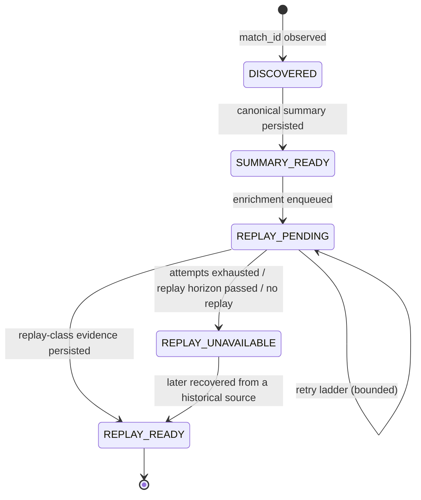
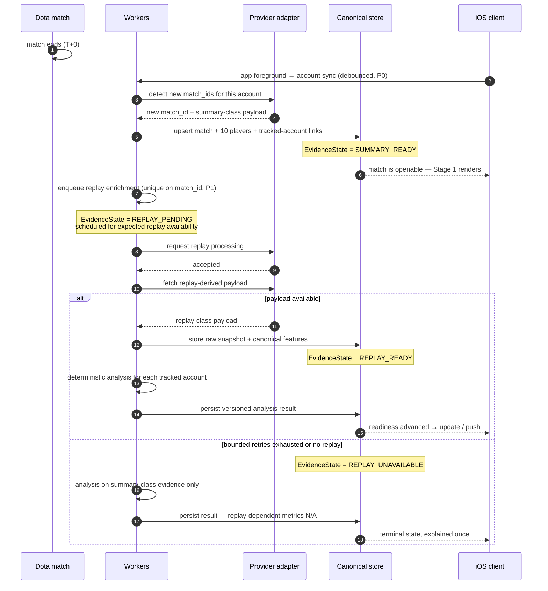

# Match Ingestion and Lifecycle

**Status:** ACTIVE — authoritative
**Last updated:** 2026-09-20
**Scope:** How a match travels from "it ended" to "the player can read its analysis": detection, the evidence-readiness model, enrichment scheduling, retries, terminal cases, and how all of that maps onto the product's locked match lifecycle.
**Depends on:** [`SYSTEM-ARCHITECTURE.md`](SYSTEM-ARCHITECTURE.md) · [`../app_foundation/SSOT.md`](../app_foundation/SSOT.md) §4 · [`decisions/0003-progressive-post-match-readiness.md`](decisions/0003-progressive-post-match-readiness.md)
**Evidence date:** 2026-09-20 (see [`evidence/`](evidence/))

---

## 1. Plain-English summary

**What is this?** The timeline of one match, and the words we use for "how much do we know about it so far".

**Why did we choose it?** Because a Dota match does not arrive all at once. The basic result exists within a few minutes. The replay file — which everything interesting is derived from — exists later, and sometimes never. Pretending a match is either "loaded" or "not loaded" would force the product to either lie or stall.

**What does it mean for the user?** Two moments. First: *your match is here, here is what happened.* Second: *your breakdown is ready.* If the second one can never happen for a particular match, the app says so plainly and stops pretending.

**What should future agents not break?** Stage 1 must never wait for replay data. There must never be an endless spinner. And there is still exactly **one** finalisation point that produces comparisons, Personal Bests and progression — adding a second one would let the product celebrate the same thing twice.

---

## 2. Two orthogonal axes (read this before anything else)

The product already has a locked per-match lifecycle state machine ([`../app_foundation/SSOT.md`](../app_foundation/SSOT.md) §4.3). This document does **not** replace it and **MUST NOT** be turned into a competing state machine.

There are two different questions, and they need two different answers:

| Axis | Question | Scope | Defined in |
|---|---|---|---|
| **Evidence readiness** | *What do we know about this match yet?* | The match, **globally** — shared by every user in it | §3, here |
| **Lifecycle state** | *How far has this user's processing of this match got?* | Per `(match, tracked account)` | [`../app_foundation/SSOT.md`](../app_foundation/SSOT.md) §4.3 |

They are orthogonal in the same way progression classification is orthogonal to lifecycle state. Evidence readiness is a property of the *match*; lifecycle state is a property of *our processing for one player*. §5 maps them.

---

## 3. The evidence-readiness model (normative)

Vocabulary follows the terminology already in the codebase — `SUMMARY_FAMILIES` / `REPLAY_FAMILIES`, `summary_coverage` / `replay_coverage` in `services/api/app/ingestion/coverage.py`. **Do not invent a parallel vocabulary.**

### 3.1 Evidence classes

Two classes of evidence about a match:

| Class | What it is | Where it comes from |
|---|---|---|
| **Summary-class** | Everything derivable from the final scoreboard and match header: result, duration, mode, heroes, K/D/A, LH/DN, GPM/XPM, net worth, final damage / tower damage / healing, final items, ability build, draft, tower and barracks end state, all ten players. | Available without any replay processing. |
| **Replay-class** | Everything derived from the replay timeline: per-minute gold / XP / last-hit / deny / net-worth series, team advantage curves, lane assignment and lane metrics, item purchase timings, item usage, wards and deward events, camp stacking, objectives with timestamps, teamfights, kill and death logs with context, runes, damage breakdowns, positional data. | Requires a replay to have existed and been processed. |

The concrete per-capability mapping — and which provider supplies each — is in [`PROVIDER-CAPABILITIES-AND-ROUTING.md`](PROVIDER-CAPABILITIES-AND-ROUTING.md) §4. This document deals only in the classes.

### 3.2 States

```text
EvidenceState :
  DISCOVERED | SUMMARY_READY | REPLAY_PENDING | REPLAY_READY | REPLAY_UNAVAILABLE
```

| State | Meaning | Terminal? |
|---|---|---|
| `DISCOVERED` | The `match_id` is known. No canonical summary is persisted yet. | no |
| `SUMMARY_READY` | Canonical summary-class evidence is persisted for the match and all ten players. **This is the point at which the match becomes a real, openable thing in the product.** | no |
| `REPLAY_PENDING` | Replay-class enrichment is scheduled, in flight, or in its retry ladder. | no |
| `REPLAY_READY` | Replay-class evidence is persisted and versioned. | **yes** |
| `REPLAY_UNAVAILABLE` | Replay-class evidence will not arrive. The replay never existed, processing permanently failed, or the match is outside every reachable provider's replay horizon. | **yes** |



### 3.3 Rules

1. Evidence readiness is a property of the **match**, stored once, shared by every tracked account in it.
2. `SUMMARY_READY` **MUST NOT** depend on any replay-class evidence, on any provider's parse queue, or on any provider-specific enrichment. This is the load-bearing rule of the whole design.
3. `REPLAY_UNAVAILABLE` is **terminal and explainable**, not a failure and not a retry state. A match in this state has complete, self-sufficient summary-class content.
4. `REPLAY_UNAVAILABLE` → `REPLAY_READY` is the **only** backward-looking transition, and only when a historical source later supplies the evidence (see §8). It is a deliberate re-admission, not a passive upgrade, and it obeys the finalisation rule in §5.4.
5. Evidence readiness **MUST NOT** be shown to the user in provider vocabulary. See §9.
6. There is **no** `PARTIALLY_READY` evidence state. Replay-class evidence arrives as a set or does not arrive; partial replay coverage is expressed per capability family (`coverage.by_family`), not as a state.

### 3.4 Account-level historical coverage

Backfill is **not** a per-match state. It is a per-account property, because it describes how far back our knowledge reaches:

```text
HistoricalCoverage (per dota_account, per evidence class):
  earliest_covered_match, coverage_complete, known_gaps, last_backfill_at
```

This is what lets Profile and long-horizon reporting state honestly what their claims are based on ([`../profile/SSOT.md`](../profile/SSOT.md) §6A) and what lets onboarding record `READY_WITH_GAPS` truthfully ([`../onboarding/SSOT.md`](../onboarding/SSOT.md) §5.4).

---

## 4. Fresh-match runtime sequence (normative)

The ordered steps. Timings are **measurements taken on 2026-09-20**, not commitments — see §7.

1. **Detect** the new `match_id` from the fresh-match provider.
2. **Persist** the canonical summary-class match and its ten player rows. Attach every tracked account present in the roster. → `SUMMARY_READY`.
3. **Expose** the match to the product immediately. Stage-1 UI is usable now.
4. **Enqueue** replay enrichment, keyed and deduplicated on `match_id`. → `REPLAY_PENDING`.
5. **Schedule** the enrichment for when replay availability is expected, not immediately. Requesting before the replay exists wastes a request and accomplishes nothing (TESTED 2026-09-20: requests issued at ~T+3 min produced no parse; re-requests after ~T+6 min completed in ~25 s).
6. **Request** replay processing from the routed provider.
7. **Fetch** the replay-derived payload. Store it as an immutable, provenance-tagged snapshot.
8. **Normalise** into the canonical feature model. → `REPLAY_READY`.
9. **Run deterministic analysis** for every tracked account in the match.
10. **Persist** the versioned analysis result.
11. **Notify / update** the client that readiness advanced.



### 4.1 Rules for the fresh path

| # | Rule |
|---|---|
| F-1 | Detection and enrichment **MUST** be keyed on `match_id`, never on `(user, match)`. ([ADR 0002](decisions/0002-match-id-as-global-unit-of-work.md)) |
| F-2 | Step 3 **MUST NOT** wait for steps 4–11. |
| F-3 | Replay processing **MUST NOT** be requested before replay availability is expected. Premature requests consume quota and produce nothing. |
| F-4 | The replay-class provider on the fresh path **MUST NOT** be STRATZ without a new accepted ADR. ([ADR 0001](decisions/0001-provider-independent-hybrid-ingestion.md) — current routing policy is in [`PROVIDER-CAPABILITIES-AND-ROUTING.md`](PROVIDER-CAPABILITIES-AND-ROUTING.md) §5.) |
| F-5 | Account sync **MUST** be debounced per Dota account, globally — not per user, not per screen, not per follower. |
| F-6 | Enrichment jobs **MUST** be idempotent and uniquely constrained on `(match_id, job_type)`. Overlapping discovery, retries and workers merge; they never duplicate. |
| F-7 | Steps 9–10 run **once per tracked account per analysis version**, from shared match evidence. |
| F-8 | Provider checkpoints are provenance-bound and monotonic before the match finalises. A stale response **MUST NOT** regress them. ([`../app_foundation/SSOT.md`](../app_foundation/SSOT.md) §4.5.) |

### 4.2 Retry ladder

- Retries are **bounded**, with backoff. Exact counts and intervals are implementation policy, not product meaning ([`../app_foundation/SSOT.md`](../app_foundation/SSOT.md) §4.5).
- A retry for replay enrichment keeps the match at `REPLAY_PENDING`. `RETRYING` is attempt metadata, never a durable state.
- Exhausting the ladder moves the match to `REPLAY_UNAVAILABLE`. It does **not** move it to lifecycle `ACTION_REQUIRED` — see §5.3.
- A provider success followed by an **internal** failure retries internal work only; it **MUST NOT** refetch source truth.

---

## 5. Mapping onto the product lifecycle (normative)

This is the join between architecture and product. Get this wrong and either the product stalls or it double-counts.

### 5.1 The map

| Evidence state | Lifecycle state for a tracked account | What the product may do |
|---|---|---|
| `DISCOVERED` | `WAITING_FOR_PROVIDER` | Match may be listed from whatever identity facts exist. |
| `SUMMARY_READY` | `WAITING_FOR_PROVIDER` | **Stage 1**: the full factual match record renders and is navigable. |
| `REPLAY_PENDING` | `WAITING_FOR_PROVIDER` | Stage 1 plus an honest processing affordance on replay-dependent sections. |
| `REPLAY_READY` | `ANALYZING` → `WAITING_FOR_PRIOR_MATCH` → `READY` | Stage 2 unlocks when analysis persists. |
| `REPLAY_UNAVAILABLE` | `ANALYZING` → `WAITING_FOR_PRIOR_MATCH` → `READY` | Analysis runs on summary-class evidence. Replay-dependent metrics are **N/A with a reason**; replay-dependent sections show the terminal explained state. |

Lifecycle `ACTION_REQUIRED` and `UNAVAILABLE` sit outside this map — see §5.3.

### 5.2 One finalisation point (normative)

**This preserves the locked product contract and is the single most important rule in this document.**

- There is still **exactly one** finalisation point per match. It is reached when evidence is terminal (`REPLAY_READY` **or** `REPLAY_UNAVAILABLE`) and deterministic analysis has run and persisted.
- **Before finalisation**, the product may show **non-history-dependent facts**: match identity, hero, result, mode, duration, the full ten-player scoreboard, draft, items, effective role, and raw achieved values for any metric whose evidence already exists.
- **Only at finalisation** does the product produce: baseline comparisons, context-adjusted expectations, performance states, matchup context, Personal Best determination and `NEW_PB` events, progression observations, insight cards, and any READY notification.
- There is therefore still **no partial-READY state** ([`../match_detail/SSOT.md`](../match_detail/SSOT.md) §7.2) and **no second celebration path**.

This is not a new pattern. It is the generalisation of a rule the product already locked for live matches arriving during an unsettled bootstrap ([`../onboarding/SSOT.md`](../onboarding/SSOT.md) §6.1): *show the facts immediately, defer the history-dependent finalisation*.

```text
Stage 1  =  non-history-dependent facts        (from SUMMARY_READY onward)
Stage 2  =  the single history-dependent finalisation  (at terminal evidence)
```

### 5.3 What is *not* a failure

| Situation | Correct state | Not |
|---|---|---|
| Replay will never arrive | evidence `REPLAY_UNAVAILABLE`; lifecycle proceeds to `READY` with N/A metrics | lifecycle `UNAVAILABLE` |
| Replay enrichment is retrying | evidence `REPLAY_PENDING`; lifecycle `WAITING_FOR_PROVIDER` | `ACTION_REQUIRED` |
| Match is a mode we do not score | lifecycle `READY` with progression `NONE(reason)` | a processing failure |

Lifecycle `UNAVAILABLE` is reserved for the case where **trustworthy summary-class source truth never arrived, was invalid, or was withdrawn**. A match we can see but cannot deeply analyse is not unavailable — it is a match with N/A replay-derived metrics. Relabelling one as the other is the specific error this section exists to prevent.

Lifecycle `ACTION_REQUIRED` remains what it already is: bounded automatic retries exhausted a **retryable internal or stage failure** where a user Retry is the meaningful next action. Exhausting the replay ladder is not that — nothing the user can press will make Valve publish a replay that does not exist.

### 5.4 After finalisation

- Passive provider enrichment arriving **after** a match reaches `READY` **MUST be ignored** for that match's finalised snapshot ([`../app_foundation/SSOT.md`](../app_foundation/SSOT.md) §4.7). Evidence state may advance in storage; the finalised analysis does not silently change.
- Making a finalised match's analysis change requires an authorised rebuild: role correction, metric-version bump, analysis-version bump or baseline/parameter-set bump ([`../app_foundation/SSOT.md`](../app_foundation/SSOT.md) §14). Those rebuilds read stored data and make **no provider calls**.
- A `REPLAY_UNAVAILABLE` match whose evidence is later recovered is handled as a **late-admitted historical match** under the rebuild rules, not as a live readiness advance. It generates no retroactive celebration or notification.

---

## 6. Role classification and readiness

Role Resolution is a locked product contract ([`../app_foundation/SSOT.md`](../app_foundation/SSOT.md) §5). The architecture must satisfy it without changing it.

**The locked contract, unchanged:** every successfully classified match receives an effective role immediately; exactly one of Carry / Mid / Offlane / Support; low-confidence prompts are corrective, never blocking; the latest user assertion always wins; corrections rebuild deterministically.

**What the architecture adds, normatively:**

| # | Rule |
|---|---|
| R-1 | The classifier **MUST** be able to produce an effective role from **summary-class evidence alone**. "Immediately" in the locked contract means *at `SUMMARY_READY`*. |
| R-2 | A fresh match **MUST NOT** wait on any provider's native position/role label. Dependence on a single provider's proprietary role field would make role resolution a provider dependency, which [ADR 0001](decisions/0001-provider-independent-hybrid-ingestion.md) forbids. |
| R-3 | The classifier **MAY** re-run when evidence advances to `REPLAY_READY`, using the richer evidence profile. |
| R-4 | A classifier re-run **before** the match finalises is **not a correction**: no history has been written, so nothing is rebuilt, nothing is retracted, and no notification is emitted. |
| R-5 | A classifier re-run **MUST NEVER** overwrite a user-asserted effective role, at any readiness. |
| R-6 | After finalisation, §5.4 applies: a later re-run does not silently change the match. |
| R-7 | The low-confidence correction prompt **SHOULD** be raised from the classifier's **final** run, so the user is not asked twice about the same match. |

**Current-implementation note.** The V1 classifier in `services/api/app/features/roles.py` is already provider-neutral in shape (it reads lane role, economy ranking and ward counts, not a provider's proprietary position enum) — but its support signals are replay-class, so its summary-class evidence profile is materially weaker. That is a real, tracked gap, not a design change: see [`IMPLEMENTATION-GAPS.md`](IMPLEMENTATION-GAPS.md) G-4.

---

## 7. Latency: four different things (normative)

This distinction is mandatory anywhere a number appears.

| Kind | What it is | Where it may appear |
|---|---|---|
| **Measured latency** | What a probe recorded on a stated date, with a stated sample size. | [`evidence/`](evidence/), [`PROVIDER-CAPABILITIES-AND-ROUTING.md`](PROVIDER-CAPABILITIES-AND-ROUTING.md) — always with date and n. |
| **Product copy** | What we tell users. | Feature SSOTs and design. **Must be qualitative** until production monitoring exists. |
| **Operational SLO** | An internal target we monitor and alert on. | [`SCALING-RELIABILITY-AND-OPERATIONS.md`](SCALING-RELIABILITY-AND-OPERATIONS.md) §7. Requires production P50/P90/P99. |
| **Contractual SLA** | A promise with consequences for breaching it. | **None exists. Do not create one.** |

**The product expectation this architecture supports**, stated qualitatively:

- the match result becomes available **within a few minutes** of the match ending;
- the full deep analysis **commonly** becomes available later, often within the same post-match sitting;
- some matches will never get deep analysis, and the product says so.

**Forbidden copy:** "instant analysis", "analysis available immediately", "your report is ready in 30 seconds", or any specific numeric promise. No numeric customer-facing commitment may ship until it is backed by production P50/P90/P99 monitoring over a representative sample across regions, modes, durations and times of day — not one probe.

**Measured, 2026-09-20** (for engineering planning only; full detail and caveats in [`evidence/`](evidence/)): fresh matches appeared in the detection payload at a median of ~3.4 min after match end (n=12, min 2.9, max 4.0); requested replay processing completed for 21 of 22 fresh matches between 6.2 and 7.8 min after match end (median 7.1) across two cohorts; the ~6-minute floor is Valve's replay publication, not a provider queue. A separate investigation observed a single live match whose first checks were made late (T+12m36s) and whose requested parse completed 64 s after the request — consistent, and a reminder that these are **samples, not guarantees**.

---

## 8. Historical acquisition

Historical work is a different job with different economics and a lower priority. It **MUST NOT** interfere with the fresh path.

| # | Rule |
|---|---|
| H-1 | Historical imports run at the lowest priority class and **MUST be pausable**. ([`SCALING-RELIABILITY-AND-OPERATIONS.md`](SCALING-RELIABILITY-AND-OPERATIONS.md) §2.) |
| H-2 | A new user's large history import **MUST NOT** delay another user's newly completed match. |
| H-3 | Historical backfill **MUST NOT** issue fresh-path replay-processing requests for matches outside the replay horizon. Those requests always fail (TESTED 2026-09-20: 180 / 365 / 730-day-old matches all failed to parse; a 60-day-old match succeeded; the exact boundary between 60 and 180 days is **UNKNOWN**). |
| H-4 | Replay-class evidence for matches older than the replay horizon can only come from a provider that **already holds** it. That is currently STRATZ. This is the single strongest reason STRATZ remains in the architecture. |
| H-5 | Imported history **MUST** be inserted at its true chronology position and **MUST NOT** generate retroactive celebrations, PB events, achievements or notifications ([`../app_foundation/SSOT.md`](../app_foundation/SSOT.md) §12.2, §14.2). |
| H-6 | Historical report generation runs on background, low-priority work. A screen render **MUST NOT** launch a provider backfill. |
| H-7 | Every import records its **historical coverage** (§3.4), including known gaps. Coverage is never assumed complete because a job finished. |

**The onboarding consequence, stated explicitly.** Onboarding's Free bootstrap searches up to 90 days back ([`../onboarding/SSOT.md`](../onboarding/SSOT.md) §5.1). The fresh-path replay horizon is shorter than that and its exact edge is UNKNOWN. Therefore **bootstrap matches cannot rely on the fresh-path replay route for replay-class evidence**, and a bootstrap that acquires only summary-class evidence produces a history in which most role metrics are N/A — which in turn delays baseline readiness. Deep historical acquisition is consequently a **functional requirement of onboarding**, not an optimisation. See [`FEATURE-DATA-DEPENDENCY-MATRIX.md`](FEATURE-DATA-DEPENDENCY-MATRIX.md) §5.

---

## 9. What the user is told

The UI speaks in capabilities and outcomes. It never speaks in provider or pipeline vocabulary.

| Internal | User-facing meaning |
|---|---|
| `SUMMARY_READY` | The match is here. Here is what happened. |
| `REPLAY_PENDING` | The deeper breakdown is still being put together. |
| `REPLAY_READY` | The full breakdown is available. |
| `REPLAY_UNAVAILABLE` | The detailed breakdown isn't available for this match. Stated **once**, plainly, as a settled fact. |

**Normative:**

1. Product copy **MUST NOT** name OpenDota, STRATZ, Valve, "parse", "parser", "replay parse", "GraphQL", "quota", "rate limit", "queue" or "job".
2. A pending deep section **MUST NOT** render as an endless spinner. It carries an honest processing affordance with a bounded, terminal outcome.
3. A terminal unavailable deep section **MUST** read as a settled fact, not as an error or an apology, and **MUST NOT** be retried automatically forever.
4. The user **MUST NOT** need to understand the two stages to use the app. The staging is a delivery mechanism, not a concept to teach.

---

## 10. Product/SSOT dependents

| Document | What to re-check when this document changes |
|---|---|
| [`../app_foundation/SSOT.md`](../app_foundation/SSOT.md) | §4 match lifecycle, §4A evidence readiness, §5 role classification timing. |
| [`../match_detail/SSOT.md`](../match_detail/SSOT.md) | §3A two-stage rendering, §7.2 non-READY states, terminal deep-unavailable state. |
| [`../home/SSOT.md`](../home/SSOT.md) | §3 Today's Matches at summary readiness; readiness-advance updates. |
| [`../history/SSOT.md`](../history/SSOT.md) | §2 what appears and when; §9 row states. |
| [`../progress/SSOT.md`](../progress/SSOT.md) | When progression recomputation is allowed to run. |
| [`../onboarding/SSOT.md`](../onboarding/SSOT.md) | §5 bootstrap scope vs replay horizon; §6.1 live-match-during-bootstrap. |
| [`../profile/SSOT.md`](../profile/SSOT.md) | §6A historical coverage honesty. |
