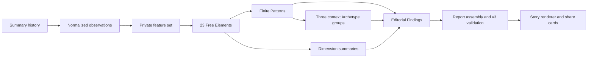

# Architecture

Dota Report Card turns one bounded OpenDota summary-history read into a public,
privacy-safe report. The Free product is deliberately layered:

Free mode uses summary rows only. It does not read individual matches or ask
OpenDota to parse replays. Missing fields stay missing; a limited Element is
not quietly converted into a neutral score. The browser receives the assembled
report and renders it. It does not calculate the model.

The canonical architecture notes live in
[docs/architecture/system-overview.md](docs/architecture/system-overview.md).
The complete human-readable model guide is in
[docs/architecture/free-dna-model-guide.md](docs/architecture/free-dna-model-guide.md).
The generated registry reference is
[docs/architecture/model-catalog.md](docs/architecture/model-catalog.md).
Run `make dna-catalog-check docs-check` before changing a registry or its public
copy.

Historical v1/v2 snapshots remain readable. New Free analyses publish
`free-dna-report-3.0.0`.
