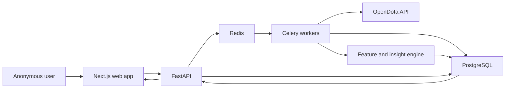

# OpenDota Insight System — Architecture and Implementation Plan

> Cost-aware implementation: broad Player DNA reads up to 200 summary rows; Deep Scan has independent match, parse, and data-cost budgets.

> Intended repository path: `docs/open-dota-insight-system-plan.md`  
> Status: Approved implementation plan  
> Reference research: `dota_report_card_insight_system_research.md`  
> Example account: Steam32 `193875165`

## 1. Objective

Build a production-oriented web application that:

1. Accepts a public OpenDota player URL or Steam32 account ID.
2. Fetches and caches up to 200 cheap player-history summaries through the OpenDota API.
3. Normalizes summary and replay-parsed data into auditable facts.
4. Computes evidence-backed behavioral insights from the 22 MVP families defined in the research.
5. Compares the player with the narrowest statistically valid cohort.
6. Suppresses unsupported or low-confidence conclusions.
7. Presents a player-facing report with strengths, contradictions, weaknesses, and measurable practice goals.
8. Retains enough source, model, and evidence metadata to reproduce every displayed sentence.

V1 is an anonymous public-profile product using Next.js, FastAPI, Celery, Redis, and PostgreSQL.

## 2. Success Criteria

A successful implementation must:

- Generate useful summary insights even when replay coverage is poor.
- Emit replay-dependent insights only when their coverage and denominator gates pass.
- Produce deterministic results from the same data and model version.
- Never expose the OpenDota API key to the browser, URLs, logs, fixtures, or database records.
- Never let templates or future LLM integrations invent or strengthen findings.
- Show the denominator, coverage, comparison cohort, confidence, and material confounders for every published insight.
- Return an explicit “not enough evidence” state instead of falling back to misleading raw averages.
- Analyze account `193875165` end to end using recorded fixtures and, separately, a live smoke test.
- Preserve raw payloads, normalized facts, derived features, model versions, and evidence objects as distinct layers.

## 3. Locked Product Decisions

- Product shape: full web application.
- Frontend: Next.js with TypeScript.
- Analytics/API: Python with FastAPI.
- Background processing: Celery with Redis.
- Primary database: PostgreSQL.
- Report access: anonymous public-profile lookup.
- Match depth: broad history up to 200 summaries; Deep Scan selects at most the configured deep-match budget.
- Insight scope: all 12 MVP-A and 10 MVP-B families.
- Narrative: deterministic, approved, versioned templates.
- Replay parsing: consume existing parsed data; never request parsing automatically.
- Cohort bootstrap: transparent fallback with suppression when no valid comparison exists.
- Deployment: containerized and cloud-neutral.
- Next-Rank Gap, archetype clustering, and post-won-fight-overreach remain post-MVP features.

## 4. System Architecture



### Analysis lifecycle

1. Validate and normalize the submitted player identifier.
2. Reuse a compatible completed analysis or create a new job.
3. Fetch the profile and up to 200 cheap match-list records for Player DNA.
4. Filter eligible matches and record exclusion reasons.
5. Detect summary-only Player DNA patterns and generate deterministic hypotheses.
6. In Deep Scan mode, select a globally deduplicated, budgeted match set.
7. Hydrate only selected or locally cached match details.
8. Normalize participants, events, time series, objectives, inventory, and parse coverage.
9. Infer role and calculate match-level features.
10. Select valid cohorts and calculate adjusted metrics.
11. Evaluate registered insight candidates.
12. Apply statistical, coverage, holdout, and redundancy gates.
13. Rank surviving evidence using Insight Value Score.
14. Render approved narrative templates.
15. Persist the report and publish its unguessable report URL.

## 5. Repository and File Boundaries

```text
/
├── apps/
│   └── web/                         # Next.js UI; no direct OpenDota access
├── services/
│   └── api/
│       ├── app/api/                 # FastAPI routes, request/response models
│       ├── app/core/                # Config, logging, security, job infrastructure
│       ├── app/opendota/            # OpenDota client, schemas, retries, caching
│       ├── app/ingestion/           # Eligibility, normalization, coverage ledger
│       ├── app/features/            # Reusable match/player feature calculators
│       ├── app/cohorts/             # Cohort selection, aggregation, fallback
│       ├── app/insights/            # Registry, gates, ranking, templates
│       ├── app/reports/             # Report assembly and persistence
│       ├── app/workers/             # Celery tasks and job orchestration
│       └── migrations/              # Alembic migrations
├── packages/
│   └── api-client/                  # Generated TypeScript client from OpenAPI
├── tests/
│   ├── fixtures/opendota/           # Sanitized recorded API payloads
│   ├── golden/                      # Expected evidence objects
│   ├── integration/
│   └── e2e/
├── infra/
│   ├── docker/
│   └── compose.yaml
├── docs/
│   ├── open-dota-insight-system-plan.md
│   ├── evidence-contract.md
│   └── insight-catalog.md
├── Makefile                         # Canonical developer commands
├── .env.example
└── README.md
```

### Ownership rules

- `apps/web` displays API responses and never recomputes analytics.
- `app/opendota` is the only code allowed to know OpenDota transport details.
- `app/features` produces reusable typed features without publishing conclusions.
- `app/insights` consumes features and cohorts and is the only layer that emits evidence objects.
- Templates consume approved evidence objects; they cannot query raw data.
- TypeScript API types are generated from FastAPI’s OpenAPI document rather than maintained manually.

## 6. Public Interfaces

### Create analysis

```http
POST /v1/analyses
Content-Type: application/json

{
  "player": "https://www.opendota.com/players/193875165",
  "refresh": false
}
```

Response:

```json
{
  "job_id": "uuid",
  "status": "queued",
  "reused": false,
  "events_url": "/v1/analyses/uuid/events"
}
```

### Get analysis status

```http
GET /v1/analyses/{job_id}
```

Return the stage, processed/eligible match counts, warnings, failure code, and `report_id` when completed.

Stages:

- `validating_player`
- `fetching_history`
- `filtering_matches`
- `detecting_patterns`
- `hydrating_selected_matches`
- `normalizing`
- `computing_features`
- `building_cohorts`
- `evaluating_insights`
- `rendering_report`
- `completed`
- `failed`

### Read report

```http
GET /v1/reports/{report_id}
GET /v1/reports/{report_id}/evidence/{insight_id}
```

Reports are read-only, use unguessable UUIDs, and are marked `noindex`.

### Error contract

Use stable machine-readable codes:

- `INVALID_PLAYER_IDENTIFIER`
- `PROFILE_PRIVATE_OR_UNAVAILABLE`
- `INSUFFICIENT_MATCH_HISTORY`
- `OPENDOTA_RATE_LIMITED`
- `OPENDOTA_UNAVAILABLE`
- `ANALYSIS_FAILED`
- `REPORT_NOT_FOUND`

Operational details remain server-side.

## 7. OpenDota Integration

### Authentication and secrets

- Configure `OPENDOTA_API_KEY` only in server/worker secret storage.
- Authenticate through `Authorization: Bearer`.
- Redact `Authorization`, `api_key`, and configured secret values from structured logs and exception reports.
- Rotate the key supplied during planning before using it outside local development.

### Required endpoints

- `/players/{account_id}`
- `/players/{account_id}/matches?limit=200` for the broad summary pass.
- `/matches/{match_id}`
- `/constants/{resource}`
- `/heroStats`
- `/benchmarks`
- `/publicMatches` for controlled cohort collection

### Eligibility defaults

Include matches satisfying all of:

- Ranked lobby.
- Standard All Pick.
- No abandon.
- Valid duration and outcome.
- Player participant row can be identified.

Exclude Turbo, bot, arcade, unranked, pro/league, abandoned, and malformed matches. Persist every exclusion reason.

### Caching and resilience

- Parsed match details: immutable cache unless parser/schema migration requires re-normalization.
- Unparsed recent matches: bounded refresh TTL because they may later become parsed.
- Player profile/history: short TTL to allow new reports after additional matches.
- Constants: versioned snapshots; never overwrite historical meaning.
- Retries: exponential backoff with jitter for `429`, timeouts, and `5xx`.
- Concurrency: configurable and bounded globally and per account.
- Jobs: idempotent and resumable after worker restarts.
- Logs: record endpoint name, status, latency, and request ID—not secret-bearing URLs or full payloads.

The app must not submit `/request/{match_id}` replay-parsing jobs in v1.

## 8. Data Model

Primary tables:

- `players`: account identity and current public profile metadata.
- `matches`: normalized match context and outcome.
- `match_participants`: participant summary facts and inferred role.
- `match_time_series`: parsed minute-level economy and experience series.
- `match_events`: typed kills, deaths, purchases, objectives, and buybacks.
- `teamfights`: parser-defined fight windows and participant contributions.
- `ward_events`: placement and removal facts.
- `raw_payloads`: endpoint, source ID, payload hash, JSONB, and fetch time.
- `parse_coverage`: availability and parser version by match and feature family.
- `constant_snapshots`: versioned heroes, items, patches, modes, and related metadata.
- `derived_features`: feature ID/version, entity scope, value, denominator, and provenance.
- `cohort_aggregates`: cohort dimensions, sample size, distinct-player count, estimates, and intervals.
- `analysis_jobs`: state, progress, retry count, warnings, and failure details.
- `reports`: account, data cutoff, model version, template version, and report JSON.
- `evidence_objects`: one auditable record per evaluated/published insight.

Raw payloads, normalized facts, features, and evidence must never be collapsed into a single JSON document.

## 9. Role Inference

Use parsed `lane_role` evidence when available. Otherwise infer position 1–5 from:

- Team-relative last hits, GPM, net worth, and gold spent.
- Support and ward behavior.
- Final inventory and support-item signals.
- Hero-role priors.
- Lane evidence when present.
- Farm and economy rank across the player’s team.

Store:

- `inferred_role`
- `role_probability`
- `role_method`
- contributing signals
- role-model version

Suppress role-specific comparisons below the calibrated confidence threshold. Never silently substitute a low-confidence role.

## 10. Cohort System

Use the narrowest supported cohort:

```text
hero + role + rank + patch
→ hero + role + rank
→ role + rank + patch
→ role + rank
→ rank
→ global
```

Also adjust internally for duration, side, mode, party size when verified, match date, and early game state.

Minimum behavior:

- Prefer internal participant-level cohorts.
- Use OpenDota aggregates only when metric definitions are compatible.
- Require sufficient rows and distinct players.
- Record the selected fallback level in every evidence object.
- Suppress comparison claims if no valid level qualifies.
- Populate the warehouse from hydrated participant rows and a throttled public-match collector.
- Reweight aspirational comparisons to the player’s hero/role mixture in the later Next-Rank phase.

## 11. Insight Registry

Every insight definition must declare:

```python
class InsightDefinition:
    id: str
    concept_id: str
    categories: list[str]
    evidence_class: str
    required_features: list[str]
    eligibility: EligibilityRule
    cohort_dimensions: list[str]
    minimum_matches: int
    minimum_situations: int
    minimum_parse_coverage: float | None
    effect_gate: EffectGate
    confidence_method: str
    statement_template_id: str
    action_template_id: str
    base_ivs: float
    version: str
```

### MVP-A: summary-capable families

1. Adjusted role fit.
2. Hero-role fit residual.
3. Comfort versus stretch picks.
4. Specialization and hero-pool entropy.
5. Collapse tail and performance floor.
6. Economy-to-impact efficiency.
7. Tower-first and objective orientation.
8. Item-timing reliability.
9. Duration curve.
10. Current-form divergence.
11. Recent style shift.
12. Party, side, and mode splits.

### MVP-B: replay-dependent families

1. Advantage conversion.
2. Deaths while ahead and high-net-worth deaths.
3. Early death tax.
4. Objective follow-through.
5. Power-spike conversion.
6. Farm-to-fight pivot.
7. Lane-loss recovery.
8. Comeback and trailing-side safety.
9. Teamfight survival conversion.
10. Objective vision timing.

Do not include Next-Rank Gap, archetype clustering, or post-won-fight overreach until warehouse and segmentation QA requirements are met.

## 12. Statistical and Publication Rules

Use:

- Beta-Binomial empirical-Bayes shrinkage for rates.
- Robust median/MAD distributions and partial pooling for continuous metrics.
- Wilson or Jeffreys intervals for simple proportions.
- Player- or match-clustered bootstrap intervals for contextual metrics.
- Benjamini–Hochberg correction across screened signals.
- Recent 20–30% temporal holdout validation.
- Winsorization for model fitting while retaining explicit tail features.

Default publication gates:

- Relevant data coverage of at least 50%.
- Normally 60–70% coverage for parsed insight families.
- Never describe evidence as strong below 20 qualifying situations.
- Meet the family-specific research denominator.
- Practical effect of at least 0.25 SD, five percentage points, or odds ratio 1.25 unless explicitly overridden.
- High-confidence interval does not cross the declared null.
- Direction survives the temporal holdout.
- Result is not redundant with a higher-ranked concept.

Insight Value Score:

```text
0.20 Personalness
+ 0.20 Actionability
+ 0.20 Expected competitive impact
+ 0.15 Statistical confidence
+ 0.10 Surprise
+ 0.05 Uniqueness
+ 0.05 Understandability
+ 0.05 Benchmarkability
- redundancy penalty
- data-fragility penalty
```

Hard gates always override IVS.

## 13. Evidence Contract

Each emitted insight must contain:

- Stable insight and concept IDs.
- Categories and report scope.
- Player, cohort, effect, interval, and unit.
- Match, situation, and parsed-match denominators.
- Parse coverage and role certainty.
- Selected cohort and fallback level.
- Evidence statements backed by source match IDs.
- Confidence classification.
- Material confounders.
- Action behavior, measurable target, and practice window.
- Feature, cohort, model, and template versions.
- Publication/suppression reason.

Templates may select approved phrasing but may not:

- Create findings.
- Change metrics or denominators.
- Omit material confounders.
- Upgrade confidence.
- Use causal language beyond the evidence level.
- Infer psychology, intent, morality, or communication quality.

## 14. Report UI

Render these sections:

1. Evidence scope and missingness.
2. Dota identity dimensions.
3. Three strongest superpowers.
4. Two or three contradictions.
5. Three highest-value weaknesses.
6. Next-rank section, explicitly unavailable until qualified.
7. Keep / Avoid / Work On Next.
8. Hero and role map.
9. Career/current/form evolution.
10. Evidence appendix.

Every displayed card includes:

- Player metric.
- Cohort metric where valid.
- Denominator.
- Parse coverage where relevant.
- Confidence.
- Why it matters.
- Concrete behavior.
- Next-20-match target.
- Expandable limitations and confounders.

Provide dedicated empty states for private profiles, insufficient histories, uncertain roles, sparse cohorts, and low replay coverage.

## 15. Security and Privacy Invariants

- OpenDota credentials remain server-side.
- No secret-bearing query parameters.
- No full authorization headers or raw payloads in logs.
- Report pages use unguessable IDs and `noindex`.
- Anonymous creation endpoints are rate-limited by IP and account.
- Raw HTML from external profiles is never rendered.
- API input is restricted to OpenDota player URLs or valid Steam32 IDs.
- Database queries use parameterized ORM operations.
- Errors exposed to clients contain stable codes but no stack traces.
- Recorded fixtures remove names and identifiers not required by the test.

## 16. Observability

Collect:

- OpenDota request count, latency, status, and rate-limit events.
- Cache-hit rates by endpoint.
- Analysis duration by stage.
- Eligible, excluded, hydrated, and parsed match counts.
- Role-confidence distribution.
- Cohort fallback distribution.
- Candidate, suppressed, and emitted insight counts.
- Suppression reasons.
- Model and template versions.
- Worker retries and terminal failures.

Health endpoints must distinguish API process, PostgreSQL, Redis, and worker availability.

## 17. Implementation Sequence

1. Scaffold monorepo, containers, configuration, CI, and secret redaction.
2. Add PostgreSQL models and initial Alembic migration.
3. Implement the OpenDota client, recorded fixtures, retries, and caching.
4. Implement player/history ingestion, eligibility, match hydration, and raw-payload storage.
5. Normalize summary facts, parsed features, constants, and coverage.
6. Implement role inference and confidence.
7. Build feature registry and provenance contract.
8. Build cohort aggregation and fallback.
9. Implement statistical utilities and publication gates.
10. Implement the 12 MVP-A families with golden tests.
11. Implement the 10 MVP-B families with parsed fixtures and coverage tests.
12. Add IVS ranking and redundancy control.
13. Add evidence persistence and deterministic templates.
14. Build analysis APIs, SSE progress, and job deduplication.
15. Build the Next.js input, progress, report, appendix, and empty-state pages.
16. Add end-to-end, security, load, and live smoke checks.
17. Add dashboards, operational documentation, and deployment configuration.

## 18. Canonical Commands

The implementation must expose these commands through the root `Makefile`:

```bash
cp .env.example .env
make install
make infra-up
make db-migrate
make dev
make lint
make typecheck
make test
make test-contract
make test-integration
make test-e2e
make test-live-smoke
make api-client
make infra-down
```

Tooling behind the commands:

- `pnpm` for TypeScript dependencies and Next.js.
- `uv` for Python environments and locked dependencies.
- Alembic for database migrations.
- Pytest for Python tests.
- Vitest for frontend unit tests.
- Playwright for browser end-to-end tests.
- Ruff and mypy for Python linting and typing.
- ESLint and TypeScript for frontend checks.

`make test-live-smoke` must be opt-in, require a configured key, avoid replay-parse requests, and never run in ordinary CI.

## 19. Acceptance Checks

- [ ] A public OpenDota URL and raw Steam32 ID resolve to the same account.
- [ ] A malformed identifier is rejected before any OpenDota request.
- [ ] A private/unavailable profile produces the correct empty state.
- [x] Up to 200 history rows are fetched for the summary pass and eligibility reasons are recorded.
- [ ] Match hydration is resumable and does not refetch immutable cached details.
- [ ] Re-running unchanged input reuses the compatible completed analysis.
- [ ] Every evidence object links to raw and normalized provenance.
- [ ] Every published insight passes its denominator, coverage, effect, interval, holdout, and redundancy gates.
- [ ] Low parse coverage suppresses all dependent MVP-B results.
- [ ] Sparse cohorts back off transparently or suppress the comparison.
- [ ] Role-specific conclusions are suppressed below the role-confidence threshold.
- [ ] Templates cannot change evidence values or confidence.
- [ ] No API key appears in browser traffic, URLs, logs, snapshots, fixtures, or persisted records.
- [ ] The report contains explicit evidence scope and missingness before conclusions.
- [ ] Account `193875165` produces summary analysis from recorded fixtures.
- [ ] The example account’s low parsed coverage produces an explicit replay-evidence limitation rather than fabricated parsed insights.
- [ ] All root lint, typecheck, unit, contract, integration, and end-to-end commands pass.
- [ ] Database migrations apply cleanly to an empty database.
- [ ] API and worker restarts do not duplicate jobs or evidence objects.

## 20. Deferred Work

- Next-Rank Gap analysis.
- Stable behavioral-vector archetypes.
- Post-won-fight overreach after teamfight segmentation QA.
- Automatic or opt-in replay parsing.
- LLM-assisted tone adjustment.
- Signed-in accounts and private report history.
- Prospective 20-match coaching experiments.
- Counterfactual item or draft recommendations.
- Video-level positioning and mechanical analysis.

## 21. Unresolved External Assumptions

These do not block implementation but must be validated during integration:

- The exact request and monthly limits attached to the rotated OpenDota key.
- Whether OpenDota’s production authorization-header behavior remains consistent with its current OpenAPI specification.
- How frequently an initially unparsed match becomes parsed, which determines the optimal refresh TTL.
- Whether the production deployment provider supplies managed PostgreSQL and Redis or requires separate services.
- The warehouse growth rate achievable within the available OpenDota quota.
- Whether anonymous report retention needs a later expiration policy.
- Live example-profile counts will change; deterministic acceptance assertions must use recorded fixtures rather than exact live values.

## 22. Compact Implementation Handoff

### Objective

Deliver an anonymous Next.js + FastAPI report app that ingests up to 200 OpenDota summaries, selectively hydrates Deep Scan evidence, evaluates gated insight families, and publishes deterministic evidence-backed reports.

### Non-negotiable invariants

- Analytics creates findings; templates only verbalize them.
- Summary reports work without replay data.
- Parsed insights fail closed on coverage.
- No unsupported cohort comparisons.
- Every sentence is traceable to versioned evidence.
- The OpenDota key is server-only and redacted everywhere.
- No automatic replay-parse requests.

### File boundaries

- `apps/web`: presentation and progress only.
- `services/api/app/opendota`: external API transport only.
- `services/api/app/features`: reusable facts and metrics.
- `services/api/app/cohorts`: comparison selection.
- `services/api/app/insights`: gates, ranking, and evidence.
- `services/api/app/reports`: deterministic report assembly.
- `tests/fixtures/opendota`: sanitized source fixtures.

### Start commands

```bash
cp .env.example .env
make install
make infra-up
make db-migrate
make dev
```

### Completion commands

```bash
make lint
make typecheck
make test
make test-contract
make test-integration
make test-e2e
```

### First acceptance target

Run account `193875165` through a recorded-fixture analysis. Confirm summary insights can publish, replay-dependent insights are suppressed for insufficient coverage, the evidence appendix exposes the reason, and no secret reaches the client or logs.

### Assumptions to verify first

1. Rotated API-key quota and header authentication.
2. Current OpenDota response compatibility with the checked-in schema.
3. Production PostgreSQL/Redis deployment target.
4. Sustainable cohort-collector request budget.
