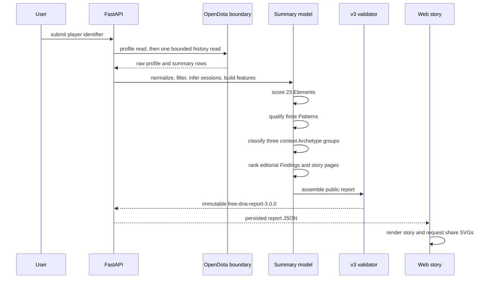

# System overview

## What the system does

Dota Report Card accepts a public player identifier and builds a deterministic
report from an explicitly bounded source window. The Free path is the cheap
scouting pass: it reads summary history, describes repeatable match patterns,
and shows where the evidence is thin. Deep Scan is a separate, opt-in pass for
selected match details.

The useful distinction is simple:

- an observation says what the summary rows contain;
- an Element measures one narrow tendency;
- a Pattern connects multiple upstream Elements;
- a context Archetype groups a finite set of Elements within one context;
- a Finding is editorial copy backed by those upstream results.

The last layer can make the report readable. It cannot add a signal that the
model did not produce.

## Free lifecycle

The profile read identifies the public display data. The history read is the
bounded analytical corpus. Free mode then makes zero per-match detail reads
and zero replay-parse requests. The cost ledger records the boundary so a
report can say what it did, not just what it concluded.

## Ownership map

| Layer | Responsibility | Does not own |
| --- | --- | --- |
| `app/opendota` | Authentication, retry, cache, and source transport | Model semantics or public copy |
| `app/ingestion` | Eligibility and nullable summary normalization | Conclusions |
| `app/dna` | Existing summary features, sessions, and compatibility dimensions | Public v3 story ordering |
| `app/behavior` | Dimensions, 23 Elements, 15 finite Patterns, and three Archetype groups | Transport and editorial prose |
| `app/findings/behavior.py` | Finding copy, receipts, ranking, experiments, and story selection | Raw history mining |
| `app/reports/dna_assembly.py` | Public projection, privacy stripping, cost/methodology metadata | Recalculating metrics |
| `app/api/report_schemas.py` | Strict v1/v2/v3 validation and compatibility dispatch | Rendering |
| `apps/web` | Story pages, accessibility, analytics events, and share controls | Recomputing scores |

The `behavior` package receives a `SummaryBehaviorContext`. It does not import
the OpenDota client, request details, or reach into raw payloads. A scorer can
fail closed for one Element while the rest of the catalog remains available.

## Public data contract

New Free reports use `free-dna-report-3.0.0`. The public payload contains:

- ten dimension summaries;
- all 23 Elements, including status, score, confidence, coverage, receipts,
  confounders, and missing reasons;
- only qualified Patterns, each referencing at least two Elements;
- exactly three context Archetype results, one for each registered group;
- editorial Findings and ordered story pages;
- factual hero identity, methodology, cost, version metadata, and privacy-safe
  share projections.

Private source match IDs and raw metrics are used inside the pipeline and
removed during assembly. Public receipts keep the value, unit, denominator,
coverage, and confidence needed to inspect the claim without exposing the
underlying match list.

## Evidence rules

The model uses a few rules because the report is more useful when the limits are
visible:

- missing is not neutral;
- confidence is metadata about evidence quality, not a score bonus;
- a Pattern consumes Element results and cannot mine the corpus independently;
- an Archetype consumes its group’s Element results and optional qualified
  Patterns;
- Findings consume Patterns, Elements, and Archetypes, then add only approved
  copy;
- summary history supports association and description, not hidden intent or
  causal explanation;
- a Deep Scan handoff is a bounded opportunity, not a promise that a detail read
  will explain the Pattern.

## Versioning and compatibility

The report carries independent versions for the behavior model, dimension,
Element, Pattern, Archetype, finding, ranking, story, copy, and renderer layers.
Changing a registry or its scoring semantics should change its version and
regenerate the catalog. The API still validates and serves existing v1/v2
snapshots; new analyses use v3.

## Failure and observability

The job exposes model stages for Elements, Patterns, Archetypes, finding
synthesis, and report rendering. A missing field family becomes an unavailable
Element with a reason. A failed scorer is recorded as unavailable rather than
silently replacing the value with zero. The report’s `quality`, `methodology`,
and `cost` sections make partial history and the no-detail Free boundary visible
to the owner and the player.
