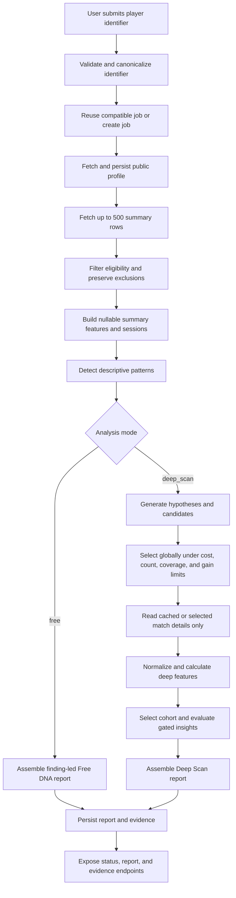

# System Behavior Baseline

Status: review contract for bug-busting agents

This document describes how the current Dota Report Card system is expected to behave. Use it as the baseline when reproducing a defect, reviewing a patch, or deciding whether an unusual result is a bug or an intentional limitation.

It is a behavior contract, not a promise that every line of the codebase already satisfies it. When code and this document disagree, record the disagreement as either a bug, a deliberate implementation gap, or a deferred product decision.

## 1. Product intent

The system accepts a public OpenDota player URL or Steam32 account ID and produces a deterministic, anonymous, evidence-backed report. The report should answer two different questions in order:

1. What broad, observable patterns appear in the player’s recent eligible history?
2. Which additional match details would be most useful for explaining the highest-priority patterns?

The first question must be answerable cheaply from match-history summaries. The second question is an explicit, bounded Deep Scan. The system must not pretend that summary data proves a replay-level cause.

The core invariants are:

- Missing data stays missing; it is never converted into a behavioral zero.
- Summary observations are descriptive. Causal or replay-dependent claims require the relevant evidence families.
- Data acquisition is selective and budgeted.
- Every published conclusion is traceable to source IDs, model/template versions, and coverage metadata.
- The browser never receives or supplies the OpenDota API key.
- Repeating the same analysis with the same inputs and model versions produces the same analytical result.

## 2. Vocabulary and layers

The layers are intentionally separate:

| Term | Meaning | Expected owner |
| --- | --- | --- |
| Summary row | A cheap record from `/players/{account_id}/matches` | OpenDota client/source and summary calculators |
| Detail payload | One `/matches/{match_id}` response | OpenDota client/source and raw-payload storage |
| Raw payload | Original source JSON plus endpoint, source ID, hash, and fetch time | Repository |
| Normalized fact | Typed match, participant, event, objective, and coverage data | Ingestion |
| Derived feature | Reusable metric calculated from normalized facts | Features |
| Pattern | Summary-level descriptive observation | Pattern detector |
| Hypothesis | Deterministic, testable explanation for an unexplained pattern | Hypothesis generator |
| Candidate match | A summary match that could support one or more hypothesis roles | Selection layer |
| Evidence object | Auditable evaluated/published insight | Insights/report persistence |
| Report | Read-only presentation projection of evidence and scope | Report assembly |

Analytics creates facts, patterns, hypotheses, and evidence. Templates and the web app may format or display those results, but must not invent, strengthen, or recalculate them.

## 3. End-to-end lifecycle



The profile and history pass is shared by both modes. The branches differ only after summary patterns have been detected.

## 4. Analysis modes

### 4.1 Free Player DNA

`free` is the default mode and is intended to be inexpensive and useful even when replay data is unavailable.

Expected behavior:

- Fetch the profile once and up to `FREE_HISTORY_LIMIT` summary rows. The hard maximum is 500.
- Apply summary eligibility rules before analysis.
- Build summary features, session groupings, hero counts, win rate, and summary coverage.
- Detect descriptive patterns such as hero overperformance, long-game differences, session decline, recent trajectory, specialization, and consistency changes.
- Derive deterministic cross-signal findings from the same eligible summary population, then apply evidence-family, confidence, privacy, copy, ranking, and redundancy gates.
- Assemble an immutable `free-dna-report-2.0.0` story with findings, experiments, eight-dimension supporting evidence, identity, DNA X-ray, and privacy-safe share variants.
- Run the dedicated DNA pipeline in visible stages: session inference, hero features, role features, dimension scoring, archetype classification, hero identity, hero recommendations, finding synthesis, and report rendering. The browser receives those job events; it never recomputes the signals.
- Include factual Signature and Comfort hero results, a reviewed hero pattern, and up to three adjacent hero recommendations in the v2 identity card when the bounded history supports them. Recommendations are adjacent-pick suggestions, not meta, counter, or coaching claims.
- Publish the summary-level Player DNA report without calling `get_match` for any history row.
- Do not normalize match details, calculate deep match features, request a replay parse, or publish replay-dependent findings.
- Mark replay evidence as `not_requested` and list replay families as missing.
- Record the history read in the cost ledger; the expected detail and parse request counts are zero.

The resilience signal is scored from the absolute size of the next-game shift after a
previous result. Its receipt keeps the direction separately, so “more after a loss”
and “less after a loss” are both treated as observable shifts rather than better or
worse player grades.

The report variant is `free_dna_report`; `free_player_dna` remains a compatibility
value only for older v1 snapshots. Its finding receipts are descriptive and its
experiment text directs the reader to test an interpretation rather than claim
that a cause is proven.

### 4.2 Explicit Deep Scan

`deep_scan` is opt-in through the API request. It starts with the same profile, history, eligibility, and summary analysis as Free Player DNA.

Expected behavior:

- Generate hypotheses only for unexplained summary patterns.
- Prefer a bounded set of primary hypotheses, prioritizing distinct source patterns before additional explanations from the same pattern.
- Generate a merged candidate pool from all primary hypotheses.
- Select matches globally, not once per hypothesis. A match may be selected once and reused for multiple evidence roles.
- Spend the configured match-count, parse-request, data-cost, and marginal-information-gain budgets.
- Prefer cached detail or already-available evidence families before a new detail read.
- Hydrate only the selected matches that still require detail data.
- Normalize selected details, calculate reusable match features, and persist their raw, normalized, and derived layers.
- Select the narrowest valid cohort when possible. If no valid cohort exists, warn or suppress the comparison rather than fabricating one.
- Evaluate the selected deep hypotheses and the existing registered rich insight families.
- Publish only findings whose required sample and data-family coverage gates pass.

The report variant is `deep_scan`. It includes the detected patterns, hypotheses, candidate/selection plan, stopping reason, deep findings, evidence scope, cost ledger, and any published or suppressed insight evidence.

The default parse budget is zero. The OpenDota transport client intentionally has no implicit parse-request method. Parse requests are available only through the separate parse client and policy/budget boundary, and must remain explicitly enabled and authorized.

### 4.3 Mode comparison

| Behavior | Free | Deep Scan |
| --- | --- | --- |
| Summary history | Up to 500 rows | Up to 500 rows |
| Profile read | Required | Required |
| Detail reads | None | Selected/cached details only |
| Automatic replay parsing | Never | Never by default; explicit capability only |
| Pattern detection | Yes | Yes |
| Hypothesis generation | Included as opportunities | Investigated when selected |
| Rich replay insight evaluation | No | Yes, subject to coverage/gates |
| Report variant | `free_dna_report` (v2; v1 accepted) | `deep_scan` |
| Expected normalized matches | 0 | At most selected eligible details |
| Job reuse key | account + model + `free` | account + model + `deep_scan` |

## 5. Input, source, and eligibility contract

### Identifier handling

The API accepts a valid OpenDota player URL, Steam32/Steam64 account ID, numeric Steam profile URL, or Steam vanity URL when the separate Steam resolver is configured. Numeric forms are converted locally; vanity resolution is cached separately and never duplicates the one OpenDota history request. Malformed identifiers must fail before any OpenDota request.

### Profile handling

The profile response must contain a matching public `profile.account_id`. A missing, private, malformed, or mismatched profile fails with a stable profile-unavailable error. The report may use the public display name/avatar returned by the source, but analytics must use the canonical account ID.

### History handling

The history request is broad but bounded:

- `FREE_HISTORY_LIMIT` defaults to 500 and cannot exceed 500.
- The source/client may return fewer rows; the service must analyze what was returned.
- An empty history or no eligible summary matches fails with `INSUFFICIENT_MATCH_HISTORY`.
- The raw profile and raw history payload are persisted before report assembly.
- The service records the number processed, the number eligible, and each exclusion reason.

### Eligibility handling

The default eligibility rules include standard All Pick and Ranked All Pick, non-abandoned, valid-duration, known-outcome matches with a usable match ID. Pro/league, Turbo, other modes, malformed rows, missing outcomes, invalid durations, and missing player rows in a hydrated detail are excluded.

Eligibility is not silent. Every exclusion has a machine-readable reason and contributes to the report’s evidence scope.

### OpenDota transport

`services/api/app/opendota` is the only layer that should know HTTP transport details. It is responsible for:

- Server-side bearer authentication.
- Retry/backoff for rate limits, timeouts, network errors, and 5xx responses.
- Cache reads/writes and request coalescing.
- Safe endpoint logging without secrets or full payloads.
- Summary, detail, constants, hero-stat, benchmark, and public-match transport methods.

The web app, report assembler, and feature calculators must not make direct OpenDota requests.

## 6. Summary feature contract

`SummaryMatchFeature` is deliberately smaller than `MatchFeature`. The summary calculator requires enough information to establish identity, duration, side, and outcome:

- `match_id`
- `duration`
- `hero_id`
- `player_slot`
- `radiant_win`

`start_time`, K/D/A, game mode, lobby type, rank, party size, parser version, economy, and lane role remain nullable when the summary row does not provide them. A malformed row is skipped; unavailable values are not replaced with zero.

The summary feature set must be invariant to input ordering. It is sorted chronologically for session calculation and exposes ordered recent matches separately.

### Session rule

Matches belong to the same session until the gap between the previous match’s end and the next match’s start is greater than `SESSION_GAP_MINUTES` (default 90). Unknown timestamps cannot establish a made-up temporal relationship. Session IDs and session positions are deterministic.

### Summary coverage

Summary coverage describes what the history rows actually contain. It must not be reported as replay coverage. A summary-only report has replay coverage `0.0` and replay status `not_requested`, even when the summary rows have complete outcomes or hero IDs.

## 7. Pattern and hypothesis contract

Patterns are observations, not diagnoses. Each pattern includes:

- Stable pattern ID and category.
- Statement and direction/effect.
- Baseline, unit, sample size, and stability/confidence signals.
- Source match IDs.
- Structured evidence with numerator/denominator where applicable.
- Confounders and an `unexplained` flag.

Only unexplained patterns feed the hypothesis generator. Hypotheses must be deterministic and serializable. Each hypothesis declares:

- The source pattern.
- An explanation type and testable statement.
- Required data families.
- Positive, negative, and control predicates.
- Minimum and target sample sizes.
- Confounders to control.
- Priority/actionability metadata.

Hypothesis statements must not imply causality before the required evidence has been acquired and evaluated.

## 8. Selection, coverage, and budget contract

The selector is a global greedy planner over the merged candidate pool.

For each candidate, the plan records relevance, contrast, comparability, extremeness, reuse, evidence roles, required/missing data families, estimated detail/parse cost, selection order, marginal gain, and a human-readable reason.

Selection must satisfy all of the following:

- No match ID is selected more than once.
- A selected match may support multiple hypotheses when its evidence roles permit reuse.
- A candidate is not charged for a required family that is already available in summary data or cached detail.
- A candidate requiring parse data cannot bypass the parse-request limit.
- The total estimated data cost cannot exceed `MAX_DATA_COST_PER_REPORT`.
- The number of selected matches cannot exceed `MAX_DEEP_MATCHES`.
- Selection stops when no candidate clears `MIN_MARGINAL_INFORMATION_GAIN`, the budget is exhausted, the evidence is sufficient, or there are no candidates.
- The stopping reason is persisted and exposed in the report.

Coverage is family-level. Required families include summary, role, economy, hero pool, inventory, time series, events, teamfights, objectives, and wards. A deep finding with incomplete required family coverage or insufficient positive/negative/control samples must be `insufficient_evidence`, not a weakly worded published causal claim.

## 9. Hydration and persistence contract

Deep acquisition follows this order for each selected match:

1. Check the repository for cached raw detail.
2. Reuse cached detail without charging a new external detail request.
3. Otherwise call the injected source’s `get_match`, record the detail cost, and persist the raw payload.
4. Re-apply detail-level eligibility, including player presence.
5. Normalize the detail into typed facts and coverage.
6. Persist normalized facts and derived features.

Free analysis stops before step 1 for individual matches. A free run must leave normalized-match and derived-feature stores empty unless those records were already present from an earlier independent operation.

Raw payloads, normalized facts, derived features, reports, and evidence are separate persistence layers. A report may reference those layers, but must not replace them with one opaque analytics blob.

## 10. Report and evidence contract

### Free report

The current free report contains:

- `schema_version=free-dna-report-2.0.0`, `report_variant=free_dna_report`, `noindex`, identity, and version metadata.
- `evidence_scope` with processed/eligible counts, summary coverage, replay status, missing replay families, and exclusion reasons.
- `dimensions` containing all eight DNA dimensions as supporting evidence rather than the primary story unit.
- `findings` containing only gated public receipts, neutral interpretation, related dimensions, and optional player-observable experiments.
- `story` and ordered `pages` for the reveal, finding-led narrative, experiment, identity card, DNA X-ray, and Deep Scan handoff.
- `shares.identity`, `shares.exposed`, and `shares.strength`, plus the legacy `dna`, `heroes`, and `final` aliases.
- `cost` and identifier-free telemetry.

The v1 validator and renderer remain available for existing snapshots; new
reports use the v2 contract. Private source match IDs may remain in internal
finding candidates for QA and debugging but never cross the public report
boundary.

### Deep report

The deep report should contain the existing rich insight sections plus:

- `report_variant=deep_scan`.
- `deep_scan.patterns`, `hypotheses`, `selection`, and `findings`.
- A cost ledger with history/detail/parse request counts, cache hits, existing matches, and estimated units.
- Telemetry for candidates, selected matches, resolved hypotheses, stopping reason, and suppressed/insufficient evidence.
- Evidence objects for evaluated insight families, including publication status and reasons.

Every evidence object must include, as applicable:

- Stable insight/concept IDs and category.
- Player and cohort values, effect, interval, unit, and denominators.
- Relevant summary/replay coverage and role certainty.
- Selected cohort/fallback level or an explicit no-valid-cohort state.
- Source match IDs and provenance references.
- Confidence, material confounders, action target, and practice window.
- Feature, cohort, model, template, and definition versions.
- Publication or suppression status/reason.

Templates may choose approved wording only. They may not modify values, denominators, coverage, confidence, or material limitations.

## 11. API and job contract

### Create an analysis

```http
POST /v1/analyses
Content-Type: application/json

{
  "player": "193875165",
  "refresh": false,
  "mode": "free"
}
```

`mode` is optional and defaults to `free`. Valid values are `free` and `deep_scan`.

The response includes `job_id`, `status`, `analysis_mode`, `reused`, and an SSE `events_url`.

### Read status

`GET /v1/analyses/{job_id}` returns the same `analysis_mode` that was requested, along with status, stage, completed stages, processed/eligible counts, warnings, failure code, message, report ID, and events URL.

The job mode is part of both in-flight coalescing and completed-result reuse. A completed Free report must not satisfy a Deep Scan request, and vice versa.

Expected stages are:

- `resolving_player`
- `player_found`
- `fetching_history`
- Free: `normalizing_history`, `session_inference`, `hero_features`,
  `role_features`, `dimension_scoring`, `archetype_classification`,
  `hero_identity`, `hero_recommendations`, `finding_patterns`, and
  `finding_synthesis`
- Deep Scan: `filtering_matches`, `detecting_patterns`,
  `hydrating_selected_matches`, `computing_features`, `building_cohorts`,
  and `evaluating_insights`
- `rendering_report`
- `completed` or `failed`

### Events and reports

`GET /v1/analyses/{job_id}/events` streams progress events and ends after completion/failure. `GET /v1/reports/{report_id}` returns a read-only report. `GET /v1/reports/{report_id}/evidence/{insight_id}` returns the matching persisted evidence object or a stable not-found error.

Stable client-facing error categories include invalid identifier, unavailable/private profile, insufficient history, OpenDota rate limiting/unavailability, analysis failure, and missing report.

## 12. Configuration baseline

The following defaults define expected local behavior:

| Variable | Default | Meaning |
| --- | ---: | --- |
| `OPENDOTA_SOURCE` | `fixture` | Use recorded fixtures locally; use `live` for a real source |
| `OPENDOTA_API_KEY` | empty | Server-only bearer credential for live OpenDota calls |
| `FREE_HISTORY_LIMIT` | `500` | Broad summary read ceiling; hard-capped at 500 |
| `MAX_DEEP_MATCHES` | `25` | Deep detail-match ceiling |
| `MAX_PARSE_REQUESTS` | `0` | Explicit parse-request ceiling |
| `MAX_DATA_COST_PER_REPORT` | `50` | Relative data-cost budget |
| `MIN_MARGINAL_INFORMATION_GAIN` | `0.05` | Selector stopping threshold |
| `MAX_PRIMARY_HYPOTHESES` | `3` | Number of primary hypothesis tracks |
| `SESSION_GAP_MINUTES` | `90` | Session break threshold |
| `DEFAULT_ANALYSIS_MODE` | `free` | Mode used when a caller omits one |
| `REPORT_RETENTION_DAYS` | `30` | Report, raw anonymous payload, and share-link retention window |
| `STEAM_API_KEY` | empty | Optional server-only key for Steam vanity resolution |

The legacy `HISTORY_LIMIT` environment name may be accepted as a compatibility fallback, but new configuration and documentation should use `FREE_HISTORY_LIMIT`.

## 13. Security and privacy baseline

- Provider keys belong in the server-side `.env`/secret store as `OPENDOTA_API_KEY` and, when vanity URLs are enabled, `STEAM_API_KEY`.
- Live use also requires `OPENDOTA_SOURCE=live`.
- The OpenDota key is sent in an `Authorization: Bearer` header only; the Steam resolver key is sent only to Steam's resolver endpoint over HTTPS.
- Steam vanity resolution is cached separately for 30 days and its key never reaches the browser.
- No browser request, URL, fixture, report, database record, structured log, or exception should contain the key.
- External profile HTML is treated as data, not rendered as trusted markup.
- API errors expose stable codes and safe messages, not stack traces.
- Report IDs are unguessable and reports are marked `noindex`.
- Anonymous creation is rate-limited by IP and account.

## 14. Deliberate limits and deferred behavior

The following are intentional and should not be filed as bugs by themselves:

- Free mode does not hydrate individual matches.
- Free mode does not request or poll replay parsing.
- Deep Scan does not automatically request replay parsing; its default parse budget is zero.
- Deep Scan only hydrates selected matches, not every eligible history row.
- Summary patterns do not claim to explain themselves.
- A low-coverage or underpowered deep hypothesis is reported as insufficient evidence or suppressed.
- Next-Rank Gap, stable archetype clustering, post-won-fight overreach, automatic parse orchestration, signed-in histories, and prospective coaching experiments are deferred.
- The default local source is fixtures and may not reflect current live OpenDota counts.
- The browser is a renderer/client, not a second analytics implementation.

## 15. Bug-busting checklist

For every suspected defect, check the mode first, then verify the following invariants.

### Acquisition and cost

- [ ] Free mode made no individual-match source calls.
- [ ] History was capped at 500 even if the source returned more.
- [ ] Deep mode selected no duplicate match IDs.
- [ ] Deep mode never exceeded the configured match or data-cost budget.
- [ ] Cached/existing evidence was not charged as a new external read.
- [ ] Parse requests were blocked when the parse budget was zero or exhausted.
- [ ] The report ledger matches observed source requests and cache behavior.

### Data correctness

- [ ] Summary input order does not change sessions, patterns, or report results.
- [ ] Missing summary K/D/A/economy/role values remain `null`/`None`.
- [ ] Detail-level eligibility is applied after hydration.
- [ ] Normalization does not invent player rows, outcomes, events, or coverage.
- [ ] Required evidence families are checked before a deep finding is resolved.
- [ ] Exclusions and missingness are visible in evidence scope.

### Selection and evidence

- [ ] Candidate reuse is reflected in selection roles and does not duplicate hydration.
- [ ] Selection stops with an explanatory reason.
- [ ] An unsupported causal explanation becomes `insufficient_evidence`, not a published claim.
- [ ] Source match IDs point to real raw payloads or summary-history provenance.
- [ ] Report cards and templates agree with persisted evidence values and confidence.
- [ ] Free report evidence says replay evidence was not requested, not that it was absent after a failed request.
- [ ] Every public finding has at least two receipts from at least two evidence families.
- [ ] Public findings, story pages, and share cards contain no account IDs, raw rows, source match IDs, or legacy/deep payloads.

### Jobs and API

- [ ] Free and Deep Scan jobs do not reuse each other’s completed result.
- [ ] Repeated same-mode requests coalesce while queued/running.
- [ ] Status exposes the requested mode and branch-appropriate stage.
- [ ] Failure status contains a stable code and no sensitive detail.
- [ ] SSE terminates after terminal job state.
- [ ] Report and evidence endpoints are read-only and use the persisted report ID.

### Reproduction evidence to attach

When filing a bug for another agent, include:

1. Analysis mode and request payload.
2. Fixture/source name and account ID.
3. Expected behavior from this document.
4. Observed behavior, including report variant and job stage.
5. Source request list, cost ledger, selected match IDs, and coverage if relevant.
6. The smallest failing test or command that reproduces it.

## 16. Verification commands

Run the narrowest relevant check first, then the full suite:

```bash
uv run pytest -q tests/unit/test_summary_analysis.py
uv run pytest -q tests/integration/test_deep_scan_selection.py
uv run pytest -q
uv run ruff check services/api tests
uv run mypy
cd apps/web && ./node_modules/.bin/tsc --noEmit
git diff --check
```

For live-source validation, configure the server-side key and run the opt-in smoke test. Live smoke tests must not run in ordinary CI and must not request replay parsing.

## 17. Source-of-truth references

- [Repository README](../README.md) — local setup, source selection, and architecture overview.
- [Implementation plan](../PLAN.md) — broader product architecture, deferred work, and acceptance context.
- [Evidence contract](evidence-contract.md) — evidence-object and template invariants.
- [Analysis service](../services/api/app/analysis/service.py) — lifecycle orchestration.
- [Deep Scan orchestration](../services/api/app/analysis/deep_scan.py) — parse boundary, selection plan, hydration, and deep findings.
- [Summary models](../services/api/app/features/summary_models.py) and [summary calculators](../services/api/app/features/summary_calculators.py) — summary-stage contract.
- [Selection planner](../services/api/app/selection/planner.py) — global match selection and stopping behavior.
