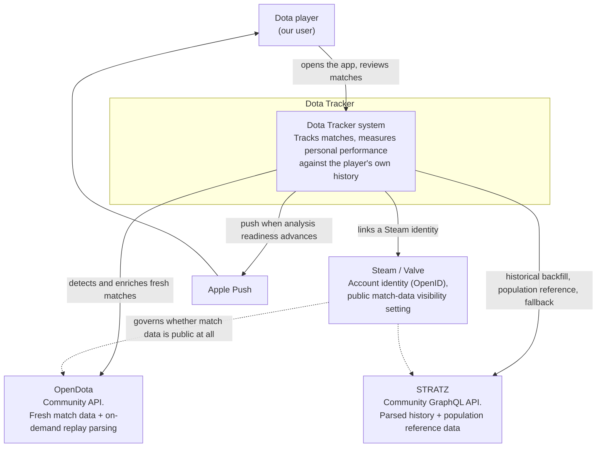
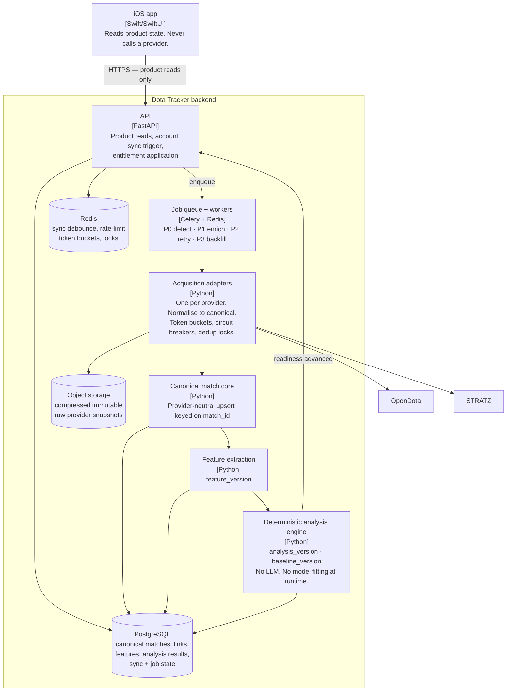

# System Architecture

**Status:** ACTIVE — authoritative
**Last updated:** 2026-09-20
**Scope:** System goals, quality attributes, boundaries, and the C4 System Context and Container views. What the parts are and what each is responsible for.
**Depends on:** [`README.md`](README.md) · [`decisions/0001-provider-independent-hybrid-ingestion.md`](decisions/0001-provider-independent-hybrid-ingestion.md)

---

## 1. Plain-English summary

**What is this?** The shape of the backend that feeds the Dota Tracker iOS app, and the line between what the app does and what the server does.

**Why did we choose it?** Because the product's core moment — "my match just ended, show me something honest and useful" — depends on data we do not own and cannot control. Two external providers have different strengths, different failure modes, and different commercial risks. If we let either one dictate our data model, a provider change becomes a product rewrite. So we put a canonical model in the middle and treat providers as swappable suppliers behind adapters.

**What does it mean for the user?** Their match appears and opens quickly, without waiting for the heavy analysis. The heavy analysis arrives shortly after and adds sections rather than replacing the screen. When a provider has a bad day, they lose *capabilities* (a chart, a section) rather than the app.

**What should future agents not break?** The client↔backend boundary (§4), the canonical model in the middle (§5), and the rule that one Dota match is one unit of work no matter how many of our users played in it ([ADR 0002](decisions/0002-match-id-as-global-unit-of-work.md)).

---

## 2. Goals

In priority order. When two conflict, the higher one wins.

1. **A completed match becomes useful to its player quickly**, without waiting for replay-derived analysis.
2. **Analysis results are reproducible** from versioned inputs, because baseline-definition changes apply retroactively to history ([`../app_foundation/SSOT.md`](../app_foundation/SSOT.md) §14) and that is impossible without stable inputs and version boundaries.
3. **Provider failure degrades capability, not the product.**
4. **Cost and work scale with unique tracked matches and accounts** — not with screen views, not with follower edges, not with the number of our users in a match.
5. **Provider routing is swappable** without touching the client, the domain model, or any feature SSOT.
6. **The system is viable with zero paying users.** Entitlement sits above the pipeline, never inside it ([ADR 0004](decisions/0004-entitlement-above-the-data-foundation.md)).
7. **Missing evidence stays missing.** Absence is never filled with zero, a default, or a fabricated comparison.

---

## 3. Quality attributes, as measurable scenarios

Written as arc42-style scenarios so they can be checked rather than argued about. **These are architecture targets, not customer promises and not SLAs** — see [`SCALING-RELIABILITY-AND-OPERATIONS.md`](SCALING-RELIABILITY-AND-OPERATIONS.md) §7 for the difference.

### 3.1 Usage scenarios

| # | Scenario | Response measure |
|---|---|---|
| QA-1 | A tracked player finishes a match and opens the app. | The match is present and openable from summary-class evidence, with no replay dependency. The screen renders from persisted state, making zero provider calls on the read path. |
| QA-2 | Replay-derived enrichment completes while the player has Match Detail open. | Deep sections become available **additively**. The Stage-1 content already on screen is not replaced, re-laid-out from scratch, or invalidated. |
| QA-3 | Five tracked players played in the same Dota match. | Exactly one provider detection path, one enrichment fetch, one parse request and one stored match. Five account links and five user-relative analyses. |
| QA-4 | 100 users follow the same Dota account. | Ingestion cost for that account is identical to one follower. Fan-out is a read against stored links. |
| QA-5 | A user opens Profile for an account with thousands of matches. | Served entirely from persisted canonical features. **Zero provider calls.** No synchronous backfill is triggered by a screen render. |

### 3.2 Change scenarios

| # | Scenario | Response measure |
|---|---|---|
| QC-1 | Measured evidence says a different provider should handle fresh detection. | The change is a routing-policy change behind the acquisition adapter plus a new ADR. No change to the iOS client, the canonical model, the analysis engine, or any feature SSOT. |
| QC-2 | A baseline definition changes and must apply retroactively to history. | Recompute runs over stored canonical features. **Zero provider calls.** Every affected result carries the new `baseline_version`. |
| QC-3 | A third acquisition source (e.g. direct Valve) is added. | It is added as another adapter writing into the same canonical match-core upsert. Nothing downstream of the canonical boundary changes. |
| QC-4 | A new analysis needs a capability no current provider supplies. | The capability matrix in [`PROVIDER-CAPABILITIES-AND-ROUTING.md`](PROVIDER-CAPABILITIES-AND-ROUTING.md) gains an UNKNOWN row and the feature stays unshipped. The architecture does not change to accommodate an unvalidated field. |

### 3.3 Failure scenarios

| # | Scenario | Response measure |
|---|---|---|
| QF-1 | The fresh-match provider is unavailable. | Every already-stored match remains fully readable and analysable. New detection degrades to the fallback path or pauses. The client never shows an empty or zeroed account. |
| QF-2 | A match's replay never becomes available, or parsing permanently fails. | The match reaches a **terminal, explained state**. Summary-class content is complete and self-sufficient. No infinite spinner, no zero-filled metrics. |
| QF-3 | STRATZ is unavailable or out of quota. | Fresh matches are unaffected. Historical backfill pauses and resumes. Population-reference data is served from the cached, versioned snapshot. |
| QF-4 | A historical import for one user is incomplete. | No other user's fresh match is delayed. Home, History and Match Detail remain available for what is stored. |
| QF-5 | Two providers disagree on a field. | Both raw snapshots are retained with provenance. Dependent analysis is quarantined rather than silently merged. Records which source produced each stored feature. |

---

## 4. System boundary

### 4.1 The client boundary (normative)

1. The iOS client **MUST** communicate with the Dota Tracker backend for all product data.
2. The iOS client **MUST NOT** call OpenDota, STRATZ, Valve or any other data provider for a product screen — directly, through a proxy, or through an embedded web view.
3. Product screens **MUST** read Dota Tracker's persisted or cached state. A screen render **MUST NOT** trigger a synchronous provider call anywhere in the stack.
4. Provider synchronisation happens **behind** the backend boundary, on background workers.
5. A provider outage therefore degrades **data acquisition**, not the client architecture.

**Why this is absolute.** It is what makes goals 3, 4 and 5 achievable at all. A client that knows a provider's shape cannot be freed from it later without an app release, and app releases are the slowest thing we control.

**One permitted exception, narrowly scoped:** an internal diagnostic or admin surface MAY name providers and show acquisition state. It is not a product screen, is not shipped to users, and its vocabulary MUST NOT leak into product copy.

### 4.2 What is inside the boundary

```text
INSIDE  (ours, we control it)
  Dota Tracker API, workers, database, object storage, caches,
  the canonical match model, feature extraction, the analysis engine.

OUTSIDE (theirs, we adapt to it)
  OpenDota, STRATZ, Valve/Steam, Apple push, the App Store.
```

### 4.3 C4 Level 1 — System Context



**Reading note.** The dotted lines matter: neither provider can show us a player whose Dota "Expose Public Match Data" setting is off. That is an account-state problem, not a provider problem, and the product has a dedicated state for it (`DATA_ACCESS_BLOCKED`, [`../onboarding/SSOT.md`](../onboarding/SSOT.md) §5.4).

### 4.4 C4 Level 2 — Containers

Runs on the existing production stack (see [`../../../legacy/AGENTS.md`](../../../legacy/AGENTS.md) §2, which describes the live Vercel/Railway/PostgreSQL/Redis/Celery deployment shared by both products). No new infrastructure technology is introduced by this architecture.



---

## 5. Components and responsibilities

The canonical model in the middle is the point of the whole design. Everything left of it is provider-shaped; everything right of it is Dota Tracker-shaped.

```text
   PROVIDER-SHAPED          │         DOTA-TRACKER-SHAPED
                            │
 provider payloads → adapters → canonical match core → features → analysis → entitlement → client
                            │
                     the canonical boundary
```

| Component | Owns | MUST NOT |
|---|---|---|
| **Acquisition adapters** | Provider transport, auth, rate-limit accounting, retries, circuit breaking, and translating one provider's payload into canonical shape. Records provenance. | Contain product logic, eligibility rules, or analysis. Leak provider field names past the boundary. |
| **Canonical match core** | The one true match record, keyed `match_id`. Upserts ten player rows. Attaches tracked-account links. Idempotent. | Be written twice for the same match by different provider paths without merging on provenance rules. Store a provider's JSON shape as if it were our model. |
| **Feature extraction** | Turning canonical + raw replay evidence into the versioned derived feature representation the analysis engine consumes. Carries `feature_version`. | Make provider calls. Make product judgments. |
| **Deterministic analysis engine** | Metrics, baselines, context adjustment, performance states, trends, PBs, insight cards. Carries `analysis_version` and `baseline_version`. | Call a provider. Call an LLM. Produce non-reproducible output. Read entitlement. |
| **Entitlement layer** | Deciding what a given user may *see* of already-computed results, and what history depth is exposed. | Change how anything is acquired, extracted, or measured. |
| **API** | Product reads from persisted state; account-sync triggering; readiness events. | Fetch from a provider on a read path. |
| **Job queue + workers** | Priority, ordering, backpressure, idempotency, retry ladders. | Let P3 historical work delay P1 fresh work. |
| **iOS client** | Presentation, navigation, local caching of our own responses, readiness display. | Call a provider. Reconstruct analysis. Fill missing values. |

---

## 6. The canonical boundary rule (normative)

1. The analysis engine **MUST** consume Dota Tracker concepts, not provider JSON.
2. Provider provenance **MUST** remain traceable for every stored feature: which provider, which operation, which schema/operation version, when it was fetched.
3. Two provider fields whose names look similar **MUST NOT** be merged into one canonical field without a documented translation rule. Where semantics differ and the correct translation is not established, the difference is recorded as **UNKNOWN** in [`PROVIDER-CAPABILITIES-AND-ROUTING.md`](PROVIDER-CAPABILITIES-AND-ROUTING.md) and the dependent feature does not ship.
4. A raw provider snapshot **MUST NOT** be overwritten by another provider's snapshot. Cache and storage identity includes provider + operation + version + match/account id.
5. Adding a provider **MUST** be possible by adding an adapter. If it is not, the boundary has been violated somewhere and that is the bug to fix.

---

## 7. Deterministic analysis (normative)

- The provider layer supplies **evidence**. The deterministic analysis system connects evidence into **findings**.
- **No LLM runs in the runtime post-match pipeline.** Not for analysis, not for selection, not for ranking, not for copy generation at request time. ([ADR 0005](decisions/0005-deterministic-analysis-no-runtime-llm.md), and [`../match_detail/SSOT.md`](../match_detail/SSOT.md) §5.1.)
- Identical inputs and identical versions **MUST** produce identical output.
- Every user-visible finding **MUST** be traceable to: the source snapshot, the `feature_version`, the `analysis_version`, and the `baseline_version` that produced it.
- Copy and insight rules are therefore structured-input rules, auditable against a version — not generated prose.

---

## 8. Scale envelope

The architecture must carry the product from pre-launch testing to 100k+ DAU **without changing the fundamental data model**. It does not have to be *deployed* at that size now.

| What must be correct now | What may scale later |
|---|---|
| Canonical model and the provider boundary | Worker counts and concurrency |
| `match_id` as the global unit of work | Object-storage lifecycle tiers |
| Evidence-readiness semantics | Database partitioning / read replicas |
| Version boundaries and reproducibility | Multiple provider tokens, egress strategy |
| Priority classes and idempotency keys | Specialised queue infrastructure |
| Dedup and account-sync debouncing | Materialised social feeds |

Trigger points for each scaling mechanism are in [`SCALING-RELIABILITY-AND-OPERATIONS.md`](SCALING-RELIABILITY-AND-OPERATIONS.md) §9. Deploying 100k-DAU infrastructure before launch is explicitly forbidden — it is a cost, not a safety margin.

---

## 9. Product/SSOT dependents

| Document | What to re-check when this document changes |
|---|---|
| [`../app_foundation/SSOT.md`](../app_foundation/SSOT.md) | §4 Match lifecycle, §4A Evidence readiness, §14 rebuild-without-provider-calls. |
| [`../profile/SSOT.md`](../profile/SSOT.md) | That Profile reads persisted canonical features only (QA-5). |
| [`../settings_account/SSOT.md`](../settings_account/SSOT.md) | That entitlement is applied above persisted analysis. |
| All feature SSOTs | That no product screen implies a direct provider dependency. |
