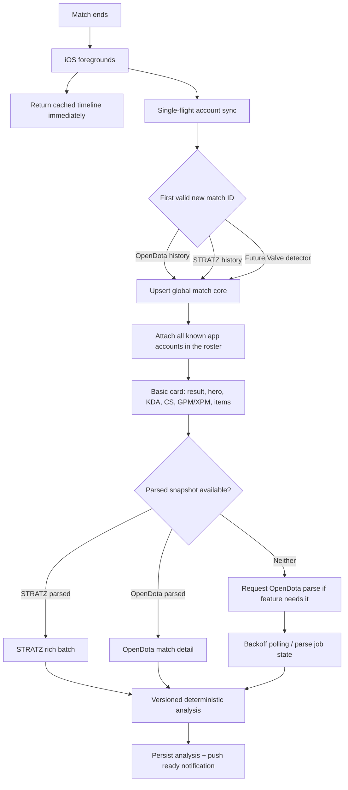
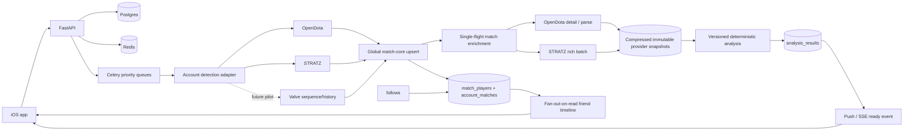

# Post-match provider architecture investigation — 2026-09-20

Status: **decision-ready for an initial architecture; provider-contract and latency-SLA questions remain open**

Task type: **BACKEND + ANALYTICAL + DOCUMENTATION**
Production behavior changed: **NO**

## Evidence labels

- **VERIFIED** — current first-party documentation or source.
- **TESTED** — a live request made on 2026-09-20 and recorded in the ignored local evidence archive.
- **INFERRED** — a conclusion derived from tested behavior or call arithmetic.
- **UNKNOWN** — public evidence and this probe do not answer the question.

The raw request ledger and responses are under the ignored local path
`.local/opendota-architecture-investigation/`. Credentials, authorization
headers, and tokens were never written there. Public player and match IDs stay
in the ignored archive and are not reproduced in this report.

## 1. Executive recommendation

Build a **provider-independent, match-centric hybrid orchestrator**. Do not make
the persisted model, analysis jobs, or client states “OpenDota-shaped” or
“STRATZ-shaped.” The system should accept the first valid match-core response,
then attach richer provider snapshots as they become available.

Initial operating policy:

1. Return the cached account timeline immediately on app foreground.
2. Run one single-flight account sync. During the measurement phase, race a
   minimal OpenDota history request and a minimal STRATZ history request. At a
   scale that exceeds the approved STRATZ token, keep OpenDota as the paid,
   explicitly scalable detection fallback and spend STRATZ only within its
   authorized quota.
3. Upsert a newly observed `match_id` once globally, attach all known app users
   in that match, and show the basic card immediately.
4. Enrich once per match. Prefer whichever parsed snapshot is both available
   and capable of the requested analysis. STRATZ is highly batch-efficient;
   OpenDota is an explicit paid fallback and can accept parse requests.
5. Notify the user when the analysis state advances. Never hold the basic match
   card open waiting for replay-derived data.

Provider options against the product requirement:

| option | post-match latency | completeness | limits / cost | reliability and scale | implementation complexity |
|---|---|---|---|---|---|
| STRATZ-only | inconsistent in the tested accounts; no public SLA | strongest native role/lane and assist-event semantics | excellent 100-match batching, but the tested central token is 15,000 requests/day; Multi-Token eligibility is unknown | one dependency, but recent-history gaps can hide the match entirely | low–medium if central token; unknown/high if per-user Multi-Token lifecycle is required |
| OpenDota-only | basic data was available for the monitored ended match; exact first-appearance time remains unmeasured; requested parses completed in 31–64s | strong basic and broad parsed data, but not every STRATZ-native semantic | paid calls are explicit at $0.0001 each and 3,000/minute; parse POST costs ten rate units | explicit paid scaling path, but parse/replay availability has no tested SLA | medium; parse state machine and replay failure handling required |
| Valve-based | **UNKNOWN**; no configured key was available for a live test | basic match facts only unless we operate GC/replay parsing | current Dota-specific commercial limits were not established | removes aggregator dependence but assumes direct endpoint reliability that OpenDota itself currently questions | highest by far if replay parsing is included |
| Provider-independent hybrid | first valid core can win; enrichment can come from either parsed source | union of both providers without forcing every feature through both | can route work by capability and remaining quota; usually one extra detection request during the measurement phase | best degradation path and global match deduplication | medium–high, contained by one canonical boundary and immutable source snapshots |

The hybrid row wins on present evidence, but it is an orchestration choice, not
an assertion that OpenDota must always detect first or that STRATZ should only
ever be used for an “irreducible” field. Provider order should remain a measured
policy.

Why not a single provider:

- **STRATZ-only:** one GraphQL request returned 50 all-parsed exact-deep matches
  or 100 mixed-state exact-deep/rich matches, but the tested token is capped at
  15,000 requests/day and live
  player-history freshness was inconsistent.
- **OpenDota-only:** pricing and premium rate limits are explicit, summary
  history is cheap, unparsed match detail is already useful, and one requested
  parse completed in 31.3 seconds while a fresh-match parse completed in 64.2
  seconds. Automatic parsed coverage and untracked history freshness are not
  guaranteed.
- **Valve-only:** potentially the cleanest low-level detection source, but no
  Steam key was available, current Dota-specific limits are not publicly clear,
  OpenDota currently disables match-detail refetch because Valve
  `GetMatchDetails` is broken in its deployment, and Valve supplies no replay
  analytics without operating a GC/replay-parser stack.

This validates **hybrid orchestration**, not a permanently fixed preference for
one provider. STRATZ-only can become viable if STRATZ approves an iOS/server
token model with sufficient quota and a larger live freshness study clears the
observed gaps.

## 2. Ideal post-match lifecycle



Measured transport time was usually about 0.3–1.7 seconds for history/detail
requests; one OpenDota single-row history request took 4.2 seconds. Transport is
not the dominant latency. The dominant variables are when a provider inserts
the completed match and when a replay-derived snapshot becomes available.

Two explicit OpenDota parse requests completed in 31.3 and 64.2 seconds. One
STRATZ account's 69 parsed rows had a recorded `parsedDateTime - endDateTime`
median of 678 seconds, but a long tail and recent ingestion gaps make that
unsuitable as a product SLA.

One genuinely live match produced this censored end-to-end trace:

| event | elapsed from canonical `start_time + duration` | interpretation |
|---|---:|---|
| Match end | T+0 | canonical value later returned by match detail |
| `/live` row's last update | T+4m09s | the feed had already passed the canonical end |
| `/live` still returned the row as active | through at least T+11m12s | `deactivate_time=0`; `/live` is not an authoritative end signal |
| First OpenDota detail check | T+12m36s | already HTTP 200 with unparsed core; an upper bound because no earlier canonical check was made |
| First OpenDota player-history check | T+12m40s | match already present; also only an upper bound |
| OpenDota parse request | T+12m38s | accepted |
| OpenDota parsed detail observed | T+13m42s | 64.2s after request; first 30s poll was still unparsed |
| STRATZ history | absent through T+20m05s | 14 successful history polls; lower bound, not a completion latency |

This specimen rules out using OpenDota `/live` to decide that an individual
match ended and rules out an unconditional “detailed analysis within a few
minutes” promise. It does not establish when OpenDota core first appeared,
because the live-feed state delayed the first history/detail query.

## 3. STRATZ findings

### Limits and token classes

The current [STRATZ API page](https://stratz.com/api) says:

| token | stated use | second | minute | hour | day | approval/referrals |
|---|---|---:|---:|---:|---:|---|
| Default | casual/personal | 20 | 250 | 2,000 | 10,000 | login; no required referrals |
| Individual | web/community app | 20 | 250 | 4,000 | 20,000 | application; 1,000 monthly referrals |
| Multi-Token | installed desktop apps with separate user calls | 20/user | 20/user | 50/user | 100/user | application; 5,000 monthly referrals |

**TESTED:** the configured token returned a different live contract:
`8/second`, `150/minute`, `1,500/hour`, and `15,000/day`. Response headers are
the operational truth for this credential; the public table must not be
hard-coded as its runtime limit.

**VERIFIED:** Individual and Multi-Token applications are case-by-case. STRATZ
may reject usage that does not match the requested data volume and may disable
tokens that miss referral requirements.

**UNKNOWN:** public material does not establish the child-token issuance API,
whether child tokens are bound to Steam IDs, whether each user needs a STRATZ
account, whether an iOS app qualifies as the documented “desktop app” case,
whether child tokens may be pooled for server-side jobs, or whether an
application-wide cap exists above per-user limits.

### Batching and GraphQL behavior

**TESTED:** `player.matches(request: {matchIds, take, skip})` can return detailed
nested data for multiple matches in one physical GraphQL request.

| requested matches | selection | returned | HTTP | latency | bytes | physical requests |
|---:|---|---:|---:|---:|---:|---:|
| 1 | rich | 1 | 200 | 0.417s | 9,318 | 1 |
| 5 | rich | 5 | 200 | 0.376s | 43,391 | 1 |
| 8 | rich | 8 | 200 | 0.600s | 70,464 | 1 |
| 10 | rich | 10 | 200 | 0.541s | 88,047 | 1 |
| 20 | rich | 20 | 200 | 0.630s | 175,392 | 1 |
| 50 | rich | 50 | 200 | 0.907s | 443,788 | 1 |
| 100 | rich, mixed parsed state | 100 | 200 | 1.181s | 748,926 | 1 |
| 50 | exact current production deep selection | 50 | 200 | 1.152s | 802,399 | 1 |
| 100 | exact production deep selection, 69 parsed rows | 100 | 200 | 1.413s | 1,288,124 | 1 |
| 101 | basic history | 0 | 200 + GraphQL error | 0.424s | 113 | 1 |

The 101 request returned: `maximum take value ... 100`.

The prior eight-match provisional ceiling was not a GraphQL or complexity
ceiling. The old probe omitted explicit `take`; the current default list length
was ten. With explicit `take`, 50 all-parsed exact-deep matches and 100
mixed-state exact-deep/rich matches were usable.

**TESTED:** aliasing root `match(id:)` queries also worked at 5, 10, and 20
matches in one physical request. It is less maintainable than
`player.matches(matchIds:)` and is not needed for the normal per-player path.

No timeout, HTTP payload ceiling, or GraphQL complexity error occurred at the
100-match page ceiling with the exact production field selection. The page
contained 69 parsed and 31 unparsed matches, so 1.29 MB is not a worst-case
all-parsed payload. A 100-parsed-match page remains untested.

The current V7 runtime uses `MATCHES_PER_REQUEST = 8`, and its deep operation
omits explicit `take`. That is a conservative pilot policy, not a demonstrated
provider ceiling. Adding explicit `take` made the unchanged production field
selection return 50 fully parsed rows and 100 mixed rows. A future, separately
authorized runtime change could reduce a 500-match deep import from up to 63
eight-match chunks to 5 pages; it needs memory/timeout/schema tests before
release and is not implemented by this investigation.

**TESTED:** five separate `player(...)` aliases, each with one newest match,
worked in one request. Eight active accounts were checked with two GraphQL
requests. Each response decremented quota by one physical request, not by the
number of aliases.

### Minimum STRATZ calls

| workload | rich tested selection | exact deep selection |
|---:|---:|---:|
| 1 match | 1 | 1 |
| 5 matches | 1 | 1 |
| 10 matches | 1 | 1 |
| 50 matches | 1 | 1 — tested |
| 100 matches | 1 — tested | 1 — tested with 69 parsed / 31 unparsed |
| 500 matches | 5 — inferred from hard `take=100` | 5 — inferred; all-parsed page density still needs a test |

The transport and selection fit 100. Because the only 100-row sample was not
fully parsed, 50 remains the proven all-parsed batch size.

### Data and freshness strengths

- Core history includes result, timing, native position/role/lane, final
  scoreboard fields, items, and parse timestamps.
- Parsed stats include resource and damage trajectories, exact kill/death/
  assist event times, item purchases, wards, stacking, and other reports.
- A focused selection is materially smaller than the broad OpenDota parsed
  match payload.
- Match IDs and rich rows are batchable without multiplying physical calls.

### Risks

- The tested central token cannot support hundreds of thousands of per-match
  foreground refreshes.
- In one live-player comparison, OpenDota had seven matches from the previous
  4.6 days that STRATZ history did not return; STRATZ's newest row was about
  111 hours old while OpenDota's was about 2 hours old.
- In an eight-account active-player sample, both providers had a latest row for
  six accounts; they agreed on the newest match for three. STRATZ lagged by
  roughly one hour for two and by years for one. Two accounts lacked usable
  OpenDota history; one of those also lacked STRATZ history. This is a small,
  non-representative sample, but it disproves universal immediate freshness.
- In the live end-to-end specimen, the public account had older STRATZ history
  but the new match was still absent after 14 successful polls through T+20m05s.
  That is a censored lower bound, not a claim that all STRATZ ingestion takes
  longer than 20 minutes.
- `parsedDateTime` coverage and latency are selected by what STRATZ retained and
  parsed. Parsed-only analysis must measure missingness rather than silently
  condition on availability.

## 4. OpenDota findings

### Current limits and price

The current [OpenDota API plan page](https://www.opendota.com/api-keys) states:

| plan | calls | rate | price |
|---|---:|---:|---:|
| Free | 3,000/day | 60/minute | free |
| Premium/API key | unlimited | 3,000/minute | $0.01 per 100 calls |

The page says an API key requires a payment method, calls are billed at
`$0.0001` each rounded up to the nearest cent, and HTTP 404/429/500 responses
are not billed.

**TESTED:** unauthenticated headers exposed 60/minute and approximately
3,000/day. The configured key exposed approximately 3,000/minute and no daily
remaining header. All normal OpenDota probes except the explicit public header
check used the key. The account's billing state was not inspected.

### Summary history

**TESTED:** `/players/{account_id}/matches` supports projection and large result
sets.

- 100 projected rows: 1.297s, 45,568 bytes, one request.
- 1,000 projected rows: 1.143s, 330,362 bytes, one request.
- Requested fields included match ID/time/result, hero, K/D/A, LH/DN,
  GPM/XPM, items, final damage/healing, and parse version.

This means summary backfill does not require one OpenDota call per match.
Parsed detail still does.

`/players/{id}/recentMatches` returned 20 rows and 26 fixed fields in 0.497s,
but did not include items. The projectable history endpoint is the better
instant-card request.

### Unparsed versus parsed match detail

Five real match-detail calls produced two parsed and three unparsed payloads.

| state | typical response | top-level fields | player fields | usable immediately |
|---|---:|---:|---:|---|
| Unparsed | ~22.5 KB | 29 | 62–63 | full roster, hero/result, KDA, LH/DN, GPM/XPM, items, damage/healing, scores, buildings, draft, timestamps |
| Parsed | 212–316 KB | 42–44 | about 151 | unparsed fields plus trajectories, events, wards, item/ability use, objectives, teamfights, lane estimates, and interaction matrices |

Fields observed only after parsing included minute gold/XP/LH/DN/net-worth
series, objectives, teamfights, kill/death logs, item purchase logs, ward logs,
stacking, rune logs, ability/item uses, damage matrices, lane estimates, and
early lane-position histograms.

### Parse behavior

The current [OpenDota OpenAPI](https://api.opendota.com/api) says
`POST /request/{match_id}` counts as ten calls for rate-limit purposes but not
for billing.

**TESTED:** one 14.6-hour-old unparsed match accepted one physical parse request
and was parsed by the first detail poll 31.3 seconds later. The result expanded
from 22,482 to 212,777 bytes and reported parser version 22.

A newly completed match supplied a second specimen: the first detail request
was unparsed, the parse POST returned a job, the 30-second poll was still
unparsed, and the next poll returned parser version 22. Observed request-to-
parsed latency was 64.2 seconds. The parsed payload grew from 23,111 to 307,632
bytes.

This proves the path works; it does not prove queue latency, replay
availability, or success rate across regions and ages. The current
[OpenDota parser source](https://github.com/odota/core/blob/master/svc/parser.ts)
shows that parsing still depends on basic API data, GC replay metadata, replay
availability, queue capacity, and parser success.

### History refresh caveat

`POST /players/{account_id}/refresh` is documented as refreshing up to 500
matches. A public account selected from the live endpoint but returning an empty
history accepted the refresh, yet 29 polls over five minutes remained empty.
This may be privacy/no-public-history rather than queue latency, so it is a
failure-path specimen, not a refresh SLA. The app must surface “private or
unavailable” separately from “still syncing.”

### Valve-based acquisition boundary

**VERIFIED:** Valve's current [Steam Web API page](https://steamcommunity.com/dev)
requires an API key and acceptance of its terms. It does not publish a current
Dota match-ingestion SLA or Dota-specific quota on that page.

**INFERRED:** if `GetMatchHistoryBySequenceNum` remains complete and reliable,
a global sequence consumer could amortize discovery across all app users rather
than polling each account. Per-account history plus `GetMatchDetails` is the
simpler alternative but is approximately two calls per fresh user match and
still supplies only basic match facts.

**UNKNOWN / not live-tested:** there was no `STEAM_API_KEY` in the environment,
and current first-party public documentation did not establish availability,
limits, commercial suitability, or latency for the Dota match-history,
sequence, and detail methods. OpenDota's current
[configuration](https://github.com/odota/core/blob/master/config.ts) disables
its Valve detail re-fetch path with the source comment that
`SteamGetMatchDetails` is broken. That is evidence about OpenDota's deployment,
not proof that every direct Valve integration fails.

A Valve detector therefore remains a worthwhile bounded pilot, not a justified
production dependency. A Valve-only rich-analysis architecture would also
require operating a GC/replay acquisition and parser stack, which is the
highest-complexity option in this comparison.

## 5. Data capability matrix

Legend: `yes` = observed/direct, `partial` = useful but incomplete or heuristic,
`no` = absent from the tested layer, `unknown` = not established here.

| capability | OpenDota basic | OpenDota parsed | STRATZ core | STRATZ parsed | Valve Web API | minimum class |
|---|---|---|---|---|---|---|
| Match ID, time, duration, result | yes | yes | yes | yes | yes | A |
| Hero, side, K/D/A | yes | yes | yes | yes | yes | A |
| LH/DN, GPM/XPM, level | yes | yes | yes | yes | yes/likely | A |
| Final items/backpack | yes | yes | yes | yes | yes/likely | A |
| Final damage/healing/tower damage | yes | yes | yes | yes | yes/likely | A |
| Full roster and team score | yes | yes | yes | yes | yes | A |
| Personal records / PBs | derive from history | derive | derive | derive | derive | A |
| Internal baseline comparison | derive | derive | derive | derive | derive | A |
| Position/role | no | heuristic `position_est`/lane | native fields | native fields | no | C if native label is required |
| Lane outcomes | no | partial lane efficiency | direct top/mid/bottom outcome | direct | no | C |
| Gold/XP/net-worth trajectories | no | yes | no/null until parsed | yes | no | B |
| LH/DN trajectories | no | yes | no/null until parsed | yes | no | B |
| Item purchase timing | no | yes | no/null until parsed | yes | no | B |
| Item-use counts | no | yes | no/null until parsed | yes | no | B |
| Exact item-use timestamps | no | no full-match timeline | not tested | not established; tested field is count | no | unavailable from tested endpoints |
| Kill event times | no | yes | no/null until parsed | yes | no | B |
| Death event times/context | no | yes | no/null until parsed | yes | no | B |
| Assist event times | no | no full timeline | no/null until parsed | yes | no | C |
| Ward placement time/location | no | yes | no/null until parsed | yes | no | B |
| Stacking | no | yes | no/null until parsed | yes | no | B |
| Rune events | no | yes | no/null until parsed | yes | no | B |
| Objectives/tower timing | final state only | yes | final/lane context | yes | final state | B |
| Team/player final comparisons | yes | yes | yes | yes | yes | A |
| Damage/target matrices | no | yes | no | richer reports available, semantics must be checked | no | B |
| Ability-use totals/targets | no | yes | no | available reports | no | B |
| Draft | picks/bans | detailed | match context | detailed | yes/likely | A/B |
| Position/location | no | first-10-minute lane histogram + teamfight death positions | no | location report/playback paths exist; semantics/cost unresolved | no | C only if validated |
| Full ordered replay/event stream | no | no | no | playback may add data but was not tested | no | self-hosted replay parser / further STRATZ study |

Class meanings:

- **A — does not require STRATZ:** basic result/card, PBs, records, final
  scoreboard comparisons, items, and many longitudinal summaries.
- **B — either parsed provider:** resource trajectories, purchase timing,
  kills/deaths, wards, stacking, runes, objectives, and many deterministic
  post-match narratives.
- **C — STRATZ-specific in the tested provider set:** exact assist events,
  native position/role/lane and lane outcomes, and potentially richer location
  reports after semantic validation.

## 6. Minimum STRATZ dependency

Do not spend STRATZ quota for facts already in the first valid basic snapshot.
The practical STRATZ spend should be driven by a versioned capability manifest,
not by “every report uses STRATZ” or “STRATZ is only a fallback.”

Use STRATZ when at least one enabled analysis needs:

1. exact assist-event timing;
2. native STRATZ position/role/lane or lane outcome semantics;
3. a validated STRATZ-only report/playback field; or
4. STRATZ's batching makes a required parsed backfill cheaper than equivalent
   OpenDota detail calls.

OpenDota parsed data is already sufficient for most proposed economy, item,
vision, stacking, objective, kill/death, and teamfight-derived insights. A
sophisticated name does not make a feature STRATZ-dependent.

## 7. API-call experiments

### Authentication boundary

- OpenDota: one public header probe; all functional probes used the configured
  bearer key and observed the premium 3,000/minute ceiling.
- STRATZ: all requests used the configured bearer token and mandatory
  `User-Agent: STRATZ_API`.
- Valve: no credential was configured; zero live Valve calls were made.

### OpenDota request record

| test | endpoint/parameters | HTTP requests | status | latency | parsed state / relevant result | conclusion |
|---|---|---:|---|---|---|---|
| Public limit header | nonexistent `/status`, no key | 1 | 404 | 0.313s | 60/min, ~3,000/day headers | free limit observed; 404 not billed |
| Keyed limit header | nonexistent `/status`, bearer key | 1 | 404 | 0.321s | ~3,000/min header | premium rate observed |
| Discovery catalogs | `/proMatches`, `/publicMatches`, `/live` | 3 | 200 | 0.325–0.689s | real recent/live rows | useful sampling; not per-user detection |
| Player recent history | `/players/{id}/recentMatches` | 1 | 200 | 0.497s | 20 rows; 10 parsed, 10 unparsed before requested parse | cheap fixed schema; no items |
| Projected history | `/players/{id}/matches?limit=100&project=...` | 1 | 200 | 1.297s | 100 rows; 82 with parse version | immediate card + large history in one call |
| Large projected backfill | same, `limit=1000` | 1 | 200 | 1.143s | 1,000 rows | summary backfill is one call |
| Match detail comparison | `/matches/{match_id}`, five matches | 5 | 200 | 0.617–1.121s | 2 parsed, 3 unparsed | basic detail is already rich; parsing adds event layer |
| Requested parse | `POST /request/{match_id}` | 1 | 200 | 0.341s | job accepted; ten rate units per docs, zero billing | explicit enrichment path works |
| Parse completion check | one detail poll at 30s | 1 | 200 | 0.951s | parsed version 22 at T+31.3s | one successful latency specimen |
| Multi-account freshness | eight `/players/{id}/matches?limit=1` calls | 8 | 200 | 0.430–4.218s | 6 non-empty histories | no multi-player OpenDota endpoint found |
| Empty-history refresh | one refresh + 29 ten-second history polls | 30 | 200 | 302.8s wall | still empty | privacy/unavailable and pending must be separate states |
| Live-feed end observation | `/live`, one select + 48 polls | 49 | 200 | 0.346–1.080s each | target row stayed `deactivate_time=0` through T+11m12s after canonical end | do not use `/live` as the sole end detector |
| Fresh ended match | three details, three projected histories, one parse POST | 7 | 200 | 0.361–1.710s | core/history present by first checks; parsed 64.2s after request | first-appearance latency remains censored by late initial check |

### STRATZ request record

| test | parameters | physical requests | status | latency | result | conclusion |
|---|---|---:|---|---|---|---|
| Basic history 100 | one player, `take=100` | 1 | 200 | 0.427s | 100 rows, 69 `parsedDateTime` | core + parse state in one call |
| Rich batch ladder | matchIds 1/5/8/10/20/50, explicit take | 6 | 200 | 0.376–0.907s | exact requested cardinality, non-null parsed fields | one call through 50 |
| Rich 100 | 100 IDs, explicit `take=100` | 1 | 200 | 1.181s | 100 rows; parsed fields null on unparsed rows | one rich backfill page |
| Exact deep 50 | 50 parsed IDs | 1 | 200 | 1.152s | 50 full rows, 10-player context each | production selection batches far beyond eight |
| Exact deep 100 | 100 IDs, 69 parsed | 1 | 200 | 1.413s | 100 rows, 1.29 MB, no GraphQL error | page ceiling works; all-parsed 100 still needs verification |
| Take ceiling | `take=101` | 1 | HTTP 200 + GraphQL error | 0.424s | maximum 100 | practical page cap is 100 |
| Root aliases | 5/10/20 `match(id:)` aliases | 3 | 200 | 0.308–0.667s | every alias non-null | works, but player history is simpler |
| Multi-player aliases | five players/request; eight players total | 2 | 200 | 0.319–0.347s | newest histories returned | multiple players can share one physical call |
| Fresh ended match | one player's newest ten, every 30s | 14 | 200 | 0.320–1.022s | target absent through T+20m05s | one censored failure-to-appear specimen; no freshness SLA inferred |

Every physical attempt, including successful 404 limit probes and polling, is
recorded in the local JSONL ledgers. No retry occurred in the main baseline or
STRATZ batch probes. The final evidence set contains **111 OpenDota** and **30
STRATZ** physical HTTP requests. The high OpenDota count is dominated by 49
`/live` observations and 30 refresh/failure-path requests, not by the normal
per-match workflow.

## 8. Scale simulation

Let:

- `D` = daily active users;
- `m` = matches per user/day and foreground syncs after each match;
- `F = D × m` = fresh-match opportunities/day;
- `g` = average app users in the same match;
- `U = F / g` = globally unique matches/day;
- default conservative model: `g = 1`;
- `b` = accounts coalesced into one STRATZ shallow-history GraphQL request;
  the main tables use latency-first `b = 1`, while `b = 5` was tested;
- OpenDota-only parsed model: 50% need an explicit parse and one result poll;
- selective hybrid model: 25% of matches need STRATZ-only capabilities.

### Fresh-match opportunities

| DAU | 2 matches | 4 matches | 6 matches | 10 matches |
|---:|---:|---:|---:|---:|
| 100 | 200 | 400 | 600 | 1,000 |
| 1,000 | 2,000 | 4,000 | 6,000 | 10,000 |
| 5,000 | 10,000 | 20,000 | 30,000 | 50,000 |
| 10,000 | 20,000 | 40,000 | 60,000 | 100,000 |
| 50,000 | 100,000 | 200,000 | 300,000 | 500,000 |
| 100,000 | 200,000 | 400,000 | 600,000 | 1,000,000 |

### Architecture formulas

| architecture | OpenDota GET/billed | STRATZ | parse POSTs | provider cost/day | core DB writes | notes |
|---|---:|---:|---:|---:|---:|---|
| A. STRATZ-only | 0 | `F` conservative; shallow detection can be `ceil(F/b)` | 0 | no public per-call price; approved quota required | about `12U + F` | one rich foreground history call; fails when match absent |
| B. OpenDota-only, parsed every match | `2.5F` | 0 | `0.5F` | about `$0.00025F` | about `12U + F` | detection + detail + one poll for parsed half; parse POST unbilled |
| C. OpenDota instant + STRATZ deep every match | `F` | `U` | 0 | about `$0.0001F` plus approved STRATZ quota | about `12U + F` | basic from projected history, deep from STRATZ |
| D. OpenDota + selective STRATZ (25%) | `F` | `0.25U` | 0 | about `$0.0001F` plus approved STRATZ quota | about `12U + F` | remaining 75% gets basic/A-class analysis only |
| E. STRATZ Multi-Token | 0 | `F`, distributed | 0 | no public per-call price; approval unknown | about `12U + F` | each user uses `m` of stated 100/day; approval/global rules unknown |
| Valve per-user | 0 | 0 | 0 | no current per-call price established | about `12U + F` | about `2F` Valve calls for history + detail; no parsed layer |

OpenDota-only rate consumption is higher than billing calls because each parse
POST is documented as ten rate-limit units. Under the 50% parse assumption,
rate units are approximately `7.5F/day`.

### Four matches/user/day example

| DAU | F | A: STRATZ | B: OD GET / parse / cost | C: OD / STRATZ / cost | D: OD / STRATZ / cost | core rows + account links |
|---:|---:|---:|---:|---:|---:|---:|
| 100 | 400 | 400 | 1,000 / 200 / $0.10 | 400 / 400 / $0.04 | 400 / 100 / $0.04 | ~4,800 + 400 |
| 1,000 | 4,000 | 4,000 | 10,000 / 2,000 / $1.00 | 4,000 / 4,000 / $0.40 | 4,000 / 1,000 / $0.40 | ~48,000 + 4,000 |
| 5,000 | 20,000 | 20,000 | 50,000 / 10,000 / $5.00 | 20,000 / 20,000 / $2.00 | 20,000 / 5,000 / $2.00 | ~240,000 + 20,000 |
| 10,000 | 40,000 | 40,000 | 100,000 / 20,000 / $10.00 | 40,000 / 40,000 / $4.00 | 40,000 / 10,000 / $4.00 | ~480,000 + 40,000 |
| 50,000 | 200,000 | 200,000 | 500,000 / 100,000 / $50.00 | 200,000 / 200,000 / $20.00 | 200,000 / 50,000 / $20.00 | ~2.4M + 200,000 |
| 100,000 | 400,000 | 400,000 | 1,000,000 / 200,000 / $100.00 | 400,000 / 400,000 / $40.00 | 400,000 / 100,000 / $40.00 | ~4.8M + 400,000 |

Consequences:

- The tested STRATZ token's 15,000/day ceiling is exceeded at 5,000 DAU × 4
  matches for the unbatched A/C cases, and at 50,000 DAU × 4 for the
  25%-selective D model.
- Five-account shallow-history aliasing was tested and quota decremented once,
  so a coalescing window could reduce A's detection calls by about 5×: 75,000
  account syncs/day would consume 15,000 physical calls. The experiment did not
  prove that five unrelated accounts' exact deep selections fit together, so
  C/D keep the conservative one-deep-request-per-unique-match arithmetic.
- Multi-Token arithmetic fits ten matches/user/day inside the stated 100/day
  per-user limit, but qualification, issuance, server use, and global limits
  must be confirmed before treating this as a solution.
- OpenDota premium's 3,000/minute ceiling is 4.32 million request units/day if
  perfectly even. OpenDota-only at 100,000 DAU × 4 uses about 3 million rate
  units/day under the stated assumptions, leaving limited peak headroom. At ten
  matches/day it exceeds that theoretical even-rate capacity.
- OpenDota's monetary cost is predictable; parser queue capacity and provider
  commercial suitability still require written confirmation for a large app.

### Database writes

With global match deduplication, each unique match needs roughly:

- one `matches` upsert;
- ten `match_players` upserts;
- one or more provider snapshot metadata rows;
- one link per tracked app account in the roster; and
- versioned analysis rows only for enabled analyses.

That is roughly `12U + tracked-account links + analysis rows`, not ten separate
copies of the same match. At 400,000 unique matches/day, core logical rows alone
are about 4.8 million/day; use bulk `COPY`/upsert transactions and object
storage for compressed raw payloads.

## 9. Recommended backend architecture

### Minimal persisted entities

| entity | key / purpose |
|---|---|
| `users` | app identity and notification preferences |
| `dota_accounts` | account ID, ownership, privacy/sync state |
| `matches` | global `match_id`, immutable core timing/outcome, canonical status |
| `match_players` | `(match_id, player_slot)`, provider-neutral final scoreboard |
| `account_matches` | `(account_id, match_id)`, user-relative side/result/visibility |
| `provider_snapshots` | provider, operation/schema version, fetched time, digest, object-storage URI |
| `match_acquisition_state` | per-provider core/parsed/request/retry state |
| `analysis_results` | `(match_id, account_id, analysis_version, input_digest)` immutable result |
| `account_sync_state` | last cursor/check, backoff, privacy, stale/refresh state |
| `follows` | follower → Dota account; no provider payload duplication |

Skip a separate denormalized activity feed initially. Query `account_matches`
joined to `matches`; add fan-out materialization only after measured read load
requires it.

### Raw payload policy

- Keep immutable raw snapshots that were inputs to a published analysis for as
  long as that report must be reproducible.
- Store raw JSON compressed in object storage; keep digest, byte size, provider,
  operation version, schema version, and retrieval time in Postgres.
- Delete redundant polling bodies and failed duplicates after a short audit
  window (for example 30–90 days) once they are not report inputs.
- Never overwrite an OpenDota snapshot with STRATZ data or vice versa. Cache
  identity includes provider + operation + schema/version + match/account ID.
- Recompute analysis by writing a new analysis version. Do not mutate old
  results to match a new algorithm.

### Queue and deduplication

Use the existing Redis/Celery stack with these priorities:

1. `P0 fresh-detect`
2. `P1 core-detail`
3. `P2 parsed-enrichment`
4. `P3 historical-backfill`

Locks and unique constraints:

```text
sync:{provider}:{account_id}
fetch:{provider}:{operation_version}:{match_id}
parse:opendota:{match_id}
analyze:{analysis_version}:{account_id}:{match_id}:{input_digest}
```

One match involving five app users produces one provider fetch/parse and five
cheap account links/analyses. The same rule makes friend timelines economical.

### Polling policy

- Foreground: return cache, enqueue one sync if stale, and let the client use
  SSE/push or bounded backoff polling against our API—not provider APIs.
- Fresh-match window: 10–15s, then 30s, then 60s backoff for a short bounded
  period. Collapse all viewers into one task.
- Normal accounts: activity-aware checks measured in minutes/hours, not every
  screen view.
- Stop polling on private/unavailable, replay-expired, terminal parse failure,
  or configured deadline.
- No provider webhook was found. A Valve sequence scanner is the only plausible
  global push-like detector, but it needs a separate reliability and terms
  pilot.

## 10. Fresh-match versus backfill strategy

### Ongoing fresh matches

- Query the smallest history projection needed to compare newest known ID.
- Fetch/enrich only when the ID changes.
- Deduplicate by match ID before any detail or parse request.
- Keep at least 20% provider quota/headroom for retries and incident recovery.

### Backfill

| history size | OpenDota projected summary | STRATZ rich page | STRATZ exact deep, conservative |
|---:|---:|---:|---:|
| 20 | 1 | 1 | 1 |
| 50 | 1 | 1 | 1 tested |
| 100 | 1 | 1 tested | 1 tested with mixed parse state |
| 300 | 1 | 3 | 3 inferred |
| 500 | 1 | 5 | 5 inferred |
| 1,000 | 1 tested | 10 | 10 inferred |

OpenDota summary rows are not parsed detail. OpenDota deep backfill still needs
up to one match-detail call per match and a parse request for each unparsed,
replay-eligible match. Therefore:

- Free onboarding: 20–50 summary matches; enrich only the newest few.
- Pro history: queue 100–500, batch STRATZ where authorized, and use OpenDota
  detail selectively.
- 1,000-match imports: gradual P3 work only; never compete with fresh matches.
- Do not request parsing for old matches whose replay is unavailable or whose
  incremental product value is low.
- Until an all-parsed 100-row deep page passes memory and timeout gates, use 50
  as the conservative exact-deep production batch. That gives 2/6/10/20 calls
  for 100/300/500/1,000 and still materially improves on the current size 8.

## 11. Failure and degradation behavior

| failure | behavior |
|---|---|
| STRATZ quota exhausted | stop STRATZ jobs until reset; keep OpenDota/Valve core path; mark STRATZ-only insights pending/unavailable |
| STRATZ down or match missing | use OpenDota basic/parsed snapshot; do not block the match card |
| OpenDota delayed | accept STRATZ core if it has the match; keep bounded OpenDota refresh backoff |
| OpenDota parse delayed | show basic analysis; poll our state with backoff; use STRATZ parsed if it arrives |
| Replay unavailable / parse terminal failure | preserve basic result; omit replay-dependent insights; never zero-fill |
| Both histories absent | distinguish private/unavailable from still-syncing; ask user to enable public match data only when supported by evidence |
| Providers disagree | keep both immutable; compare semantic-equivalent core fields; quarantine dependent analysis instead of silently merging |
| One provider has stale history | retain last successful cursor and source timestamp; do not present it as current |

In 13 overlapping real rows, OpenDota and STRATZ agreed exactly on duration,
start time, hero, K/D/A, LH, GPM/XPM, final damage/healing, and win. That is a
useful cross-check, not proof that all fields or matches agree.

## 12. Product implications

Safe now:

- Immediately show a local “Checking for your latest match…” state.
- When the basic snapshot arrives: “Match found. Detailed analysis is still
  processing.”
- Render result, hero, KDA, CS, GPM/XPM, items, PBs, and basic comparisons from
  valid basic data.
- Progressively add parsed-only sections without replacing the basic card.

Not yet defensible:

- “Your match appears instantly.”
- “Full analysis is ready within 30 seconds.”
- “Detailed analysis always arrives within a few minutes.”

Before numeric copy, monitor at least 50–100 newly completed matches across
regions, modes, duration bands, time of day, tracked/untracked state, and both
providers. Publish P50/P90/P99 for: match-core discovery, provider history
appearance, parse request acceptance, parsed availability, and analysis-ready
time. Separate requested parse from automatic parse.

## 13. Remaining unknowns

### Ask STRATZ

1. Can an iOS consumer app qualify for Multi-Token?
2. What is the documented child-token creation/revocation API?
3. Must each end user log into STRATZ or link Steam?
4. Are child tokens tied to a Steam account, device, app user, or arbitrary ID?
5. May child tokens be stored and used by our backend for server-side jobs?
6. Is there an application-wide cap above the per-user Multi-Token quotas?
7. Which quota applies to aliases and `player.matches(matchIds:)` long-term?
8. Is commercial use, raw snapshot retention, and derived-result display
   permitted for this product?
9. Is there a freshness/parse SLA or webhook/notification path?
10. What causes recent public matches to be absent from player history while
    older rows remain?

### Ask OpenDota

1. Is Premium explicitly supported for a commercial app at projected volume?
2. Are “unlimited” daily calls subject to fair-use or anti-abuse ceilings beyond
   3,000/minute?
3. Are parse requests still unlimited in policy, and are there per-account,
   per-IP, per-match, or commercial limits?
4. Does a parse POST always consume ten rate units and zero billable units?
5. What parse queue success/latency should a paid integrator expect by region?
6. What is the supported freshness contract for tracked versus newly refreshed
   players?
7. May raw responses be retained for reproducibility and derived commercial
   analytics?

### Valve pilot needed

No `STEAM_API_KEY` was configured. Verify current Dota endpoint availability,
per-key/IP rate limits, account-history and sequence freshness, match-detail
reliability, terms for a commercial service, and whether a global sequence
scanner is operationally justified. Do not cite old 100,000/day community
numbers as a current contract.

## 14. Final architecture diagram



The architecture's stable contract is `match_id + provider provenance +
analysis version`, not a promise that any one upstream provider is always first
or always richest.

## Sources and local evidence

- [OpenDota current API plans](https://www.opendota.com/api-keys)
- [OpenDota current OpenAPI](https://api.opendota.com/api)
- [OpenDota core source](https://github.com/odota/core)
- [OpenDota parser source](https://github.com/odota/core/blob/master/svc/parser.ts)
- [STRATZ current API/token page](https://stratz.com/api)
- [STRATZ token-class explanation](https://github.com/STRATZ-Esports/knowledge-base/issues/37)
- [Steam Web API documentation/key requirement](https://steamcommunity.com/dev)
- [Existing STRATZ field inventory](../../../../research/stratz-enrichment/01-field-inventory.md)
- [Existing OpenDota parsed field study](../../../../research/opendota-parsed-match-insight-research.md)
- [Existing STRATZ live microprobe](../../../../legacy/docs/evidence/free-dna-v7-stratz-live-microprobe-2026-09-01.md)
- [Current V7 acquisition policy](../../../../legacy/services/api/report_card/player_analysis_v7/acquisition_policy.py)
- [Current versioned STRATZ deep operation](../../../../services/api/app/stratz/queries.py)
- [Current OpenDota client and cache behavior](../../../../services/api/app/opendota/client.py)
- Ignored live archive: `.local/opendota-architecture-investigation/`
